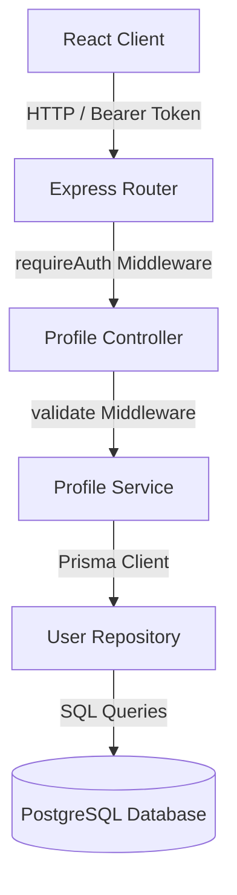
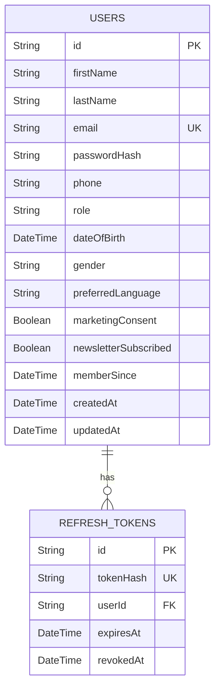

# Phase 4A: Customer Identity & Account Experience Technical Implementation Report

## 1. Overview

### 1.1 Purpose of Phase 4A
The primary purpose of Phase 4A is to transition Two Threads Studio's user authentication, profile details, and account state from mock states to a production-grade, secure, and persistent backend system. It establishes the central hub of a user's logged-in session, paving the way for commerce features.

### 1.2 Business Objectives
*   **Customer Personalization**: Allow customers to save preferences, demographic data, and update their primary contact information to personalize future interactions.
*   **Security Trust**: Implement robust password changing and token revocation strategies to align with security standards.
*   **Engagement Tracking**: Record user consent for marketing and newsletters to build compliant customer mailing lists.
*   **Aesop-Inspired Aesthetics**: Provide customers with a minimalist, typography-driven membership and details overview portal that feels cohesive and responsive.

### 1.3 Technical Objectives
*   **API-Driven State**: Fully synchronize the user's frontend session with a PostgreSQL database managed by Prisma.
*   **Robust Session Management**: Support clean invalidation of all devices on security updates (e.g., token revocation).
*   **Type Safety**: Extend Express typing to support user payloads and leverage Zod validation throughout the HTTP pipeline.
*   **React Query Integration**: Replace standard fetch/axios wrappers with cached, invalidation-driven TanStack Query state models to improve performance.

### 1.4 Architecture Summary
Phase 4A uses an N-tier architecture model consisting of:
1.  **Frontend Presentation Layer**: Built on React 19, TypeScript, and TailwindCSS.
2.  **API Client Layer**: Standardized HTTP client injecting JWTs.
3.  **Application Routing & Controller Layer**: Express 5 middleware and routing.
4.  **Service & Repository Layer**: Separates business policies from database queries.
5.  **Database Layer**: Supabase PostgreSQL with Prisma ORM.



---

## 2. Features Implemented

The following features have been successfully developed, integrated, and verified:

### 2.1 Profile Hub & Account Layout
*   **Account Layout**: A responsive, multi-tab layout consisting of an Overview Dashboard, Profile details, Security, Address Book, and Wishlist.
*   **Aesop-Inspired Editorial Sidebar**: A side navigation pane that visually adapts to active routes and collapses smoothly on smaller screen sizes.

### 2.2 Overview Tab & Dashboard Summary
*   **Membership Age Display**: Fetches and displays the user's enrollment date formatted as `Member Since [Month, Year]`.
*   **Visual Metric Cards**: Typographic indicator boxes summarizing active cart items, saved wishlist items, and saved addresses.
*   **Recommended Products**: Fetches up to four database-defined featured products and outputs their primary visual image, slug, and prices.
*   **Membership Card**: A pure CSS minimalist card reflecting editorial design.

### 2.3 Profile Management
*   **Dynamic Details Editing**: Interactive fields for updating first name, last name, phone, preferred language, date of birth, and gender.
*   **Consent Management**: Toggle switches for newsletter subscription and marketing communication consent, persisting straight to database flags.
*   **Profile Image**: Stores profile URLs (with support for gravatar or external avatar assets).

### 2.4 Security Tab
*   **Password Updates**: Change password form matching password complexity rules (uppercase, lowercase, number, special character).
*   **Session Revocation ("Logout All Devices")**: Revokes all refresh tokens registered to the customer's account in the database.

### 2.5 React Query Integration
*   **Hooks**: `useProfile`, `useUpdateProfile`, `useDashboardSummary`, `useChangePassword`, `useLogoutAllDevices` in `frontend/src/hooks/useProfile.ts`.
*   **Cache Management**: Automatic cache invalidation (`queryKey: ['profile']` and `queryKey: ['profile-dashboard']`) when profile mutations execute.

---

## 3. Backend Changes

### 3.1 Database Schema Extensions
Added demographic and marketing parameters to the `User` schema in `prisma/schema.prisma`:
*   `dateOfBirth`: `DateTime?`
*   `gender`: `String?`
*   `profileImage`: `String?`
*   `preferredLanguage`: `String` (defaults to `"en"`)
*   `marketingConsent`: `Boolean` (defaults to `false`)
*   `newsletterSubscribed`: `Boolean` (defaults to `false`)
*   `memberSince`: `DateTime` (defaults to `now()`)

### 3.2 Data Access Layer (Repository Pattern)
*   **File**: `backend/src/repositories/user.repository.ts`
*   **Functionality**:
    *   Exposed `updateProfile(userId, data)` executing direct Prisma updates:
        ```typescript
        async updateProfile(id: string, data: Partial<Prisma.UserUpdateInput>): Promise<SafeUser> {
          const updated = await prisma.user.update({
            where: { id },
            data,
          });
          return toSafeUser(updated);
        }
        ```
    *   Maintained `SafeUser` mappings to guarantee sensitive fields like `passwordHash` are not returned.

### 3.3 Routing Layer (`/api/v1/profile`)
*   **File**: `backend/src/routes/profile.routes.ts`
*   **Routes**:
    *   `GET /`: Fetches profile details. Protected by `requireAuth`.
    *   `PUT /`: Updates profile details. Protected by `requireAuth` and verified by `validate(updateProfileSchema)`.
    *   `GET /dashboard`: Fetches the metric count, name, and recommendation objects. Protected by `requireAuth`.

### 3.4 Controller Layer
*   **File**: `backend/src/controllers/profile.controller.ts`
*   **Functionality**: Wraps endpoints with `catchAsync` to handle middleware error-bubbling. Extracts user identifiers via `req.user.id` mapping.

### 3.5 Business Logic Layer (Services)
*   **File**: `backend/src/services/profile.service.ts`
*   **Functionality**:
    *   Retrieves database user objects.
    *   Triggers validation exceptions if users are missing.
    *   Calculates active count aggregates across the database:
        ```typescript
        const wishlistCount = await prisma.wishlist.count({ where: { userId } });
        const addressCount = await prisma.address.count({ where: { userId, deletedAt: null } });
        ```

### 3.6 Validation & Middleware Layer
*   **File**: `backend/src/validators/profile.validator.ts`
*   **Schema**:
    ```typescript
    export const updateProfileSchema = z.object({
      body: z.object({
        firstName: z.string().min(1).max(50).optional(),
        lastName: z.string().min(1).max(50).optional(),
        phone: z.string().nullable().optional(),
        avatarUrl: z.string().url().nullable().optional().or(z.literal('')),
        dateOfBirth: z.preprocess(
          (val) => (typeof val === 'string' && val !== '' ? new Date(val) : val),
          z.date().nullable().optional()
        ),
        gender: z.string().max(20).nullable().optional(),
        profileImage: z.string().url().nullable().optional().or(z.literal('')),
        preferredLanguage: z.string().min(2).max(10).default('en').optional(),
        newsletterSubscribed: z.boolean().optional(),
        marketingConsent: z.boolean().optional(),
      }),
    });
    ```

---

## 4. Frontend Changes

### 4.1 Page Layouts & Navigation
*   **AccountLayout** (`frontend/src/pages/Account/AccountLayout.tsx`): Integrates child tabs, handles redirection for unauthenticated requests, and handles rendering states.
*   **Sidebar** (`frontend/src/pages/Account/Sidebar.tsx`): Visual navigation panel.

### 4.2 Dashboard & Forms
*   **Overview Tab** (`frontend/src/pages/Account/Overview.tsx`): Renders metric cards, recommended items, and membership age indicators.
*   **Profile Tab** (`frontend/src/pages/Account/Profile.tsx`): Populates data inputs with query cache data and uses mutations to submit changes.
*   **Security Tab** (`frontend/src/pages/Account/Security.tsx`): Includes password editing forms with visual validation warnings and the "Logout All Devices" trigger.

### 4.3 Universal API Client
*   **File**: `frontend/src/services/apiClient.ts`
*   **Behavior**: Intercepts outgoing requests to add `Authorization: Bearer <token>` headers from local storage. Standardizes error parsing.

### 4.4 React Query Implementation
Global initialization inside `frontend/src/App.tsx`:
```typescript
const queryClient = new QueryClient({
  defaultOptions: {
    queries: {
      retry: 1,
      refetchOnWindowFocus: false,
    },
  },
});
```

---

## 5. API Documentation

### 5.1 Get Profile Detail
*   **Method**: `GET`
*   **URL**: `/api/v1/profile`
*   **Authentication**: Required (JWT Bearer Token)
*   **Request Body**: None
*   **Success Response (200 OK)**:
    ```json
    {
      "success": true,
      "data": {
        "profile": {
          "id": "cuid_string",
          "firstName": "John",
          "lastName": "Doe",
          "email": "john.doe@example.com",
          "phone": "9876543210",
          "avatarUrl": "https://gravatar.com/...",
          "role": "CUSTOMER",
          "preferredLanguage": "en",
          "dateOfBirth": "1995-05-12T00:00:00.000Z",
          "gender": "male",
          "newsletterSubscribed": true,
          "marketingConsent": true,
          "memberSince": "2026-07-11T12:00:00.000Z"
        }
      },
      "message": "Success"
    }
    ```
*   **Error Responses**:
    *   `401 Unauthorized`: Token expired or invalid.
    *   `404 Not Found`: User not found.

### 5.2 Update Profile Detail
*   **Method**: `PUT`
*   **URL**: `/api/v1/profile`
*   **Authentication**: Required (JWT Bearer Token)
*   **Request Body**:
    ```json
    {
      "firstName": "Johnathan",
      "phone": "9876543210",
      "preferredLanguage": "hi",
      "newsletterSubscribed": false
    }
    ```
*   **Success Response (200 OK)**:
    ```json
    {
      "success": true,
      "data": {
        "profile": { ...updatedSafeUser }
      },
      "message": "Profile updated successfully"
    }
    ```
*   **Error Responses**:
    *   `400 Bad Request`: Validation failure.

### 5.3 Get Dashboard Summary
*   **Method**: `GET`
*   **URL**: `/api/v1/profile/dashboard`
*   **Authentication**: Required (JWT Bearer Token)
*   **Request Body**: None
*   **Success Response (200 OK)**:
    ```json
    {
      "success": true,
      "data": {
        "summary": {
          "customerName": "Johnathan Doe",
          "memberSince": "2026-07-11T12:00:00.000Z",
          "wishlistCount": 3,
          "cartCount": 2,
          "savedAddresses": 1,
          "recentActivity": [],
          "recommendedProducts": [
            {
              "id": "prod_id",
              "name": "Aran Knit Sweater",
              "slug": "aran-knit-sweater",
              "price": 129.99,
              "comparePrice": 149.99,
              "imageUrl": "https://example.com/sweater.jpg",
              "imageAlt": "Sweater primary image"
            }
          ]
        }
      },
      "message": "Success"
    }
    ```

### 5.4 Logout All Devices
*   **Method**: `POST`
*   **URL**: `/api/v1/auth/logout-all`
*   **Authentication**: Required (JWT Bearer Token)
*   **Request Body**: None
*   **Success Response (200 OK)**:
    ```json
    {
      "success": true,
      "message": "Logged out from all devices successfully."
    }
    ```

---

## 6. Database Schema Design



### 6.1 Constraints & Indexes
*   **Unique Email Index**: Enforced on the `users` table (`email`).
*   **Cascade Deletion**: Revoking tokens uses `onDelete: Cascade` to clean up token rows.
*   **Soft Deletion**: Not applied directly to the user model, which retains an `isActive` flag instead.

---

## 7. Security Architecture

### 7.1 JWT & Refresh Token Policy
*   **Short-Lived Access Tokens**: Signed with a 64-byte key; expires in 15 minutes.
*   **Long-Lived Refresh Tokens**: Stored as a SHA-256 hash in the database.
*   **Device Context Logging**: Stores request metadata (`deviceInfo`, `ipAddress`) with refresh tokens to audit active sessions.
*   **Authentication Flow**:
    ```mermaid
    sequenceDiagram
        Client->>Auth: Request with JWT Bearer Token
        Auth->>Middleware: requireAuth verification
        Alt Token Valid
            Middleware->>Controller: req.user attached -> proceed
        Alt Token Expired / Invalid
            Middleware-->>Client: HTTP 401 (Unauthorized)
        End
    ```

### 7.2 Rate Limiting
*   Applied an Express Rate Limiter specifically to login and update endpoints (max 10 requests per 15 minutes) to protect against credential brute-forcing.

---

## 8. Folder Structure

Below is the directory mapping of modifications and creations for Phase 4A:

```
├── backend/
│   ├── prisma/
│   │   └── schema.prisma               # Added User profile details columns
│   ├── src/
│   │   ├── controllers/
│   │   │   └── profile.controller.ts   # Profile and Dashboard controller
│   │   ├── middleware/
│   │   │   └── auth.middleware.ts      # Exposes requireAuth and optionalAuth
│   │   ├── repositories/
│   │   │   └── userRepository.ts       # Extended database profiles updater
│   │   ├── routes/
│   │   │   ├── index.ts                # Mounted profile routes
│   │   │   └── profile.routes.ts       # Route layout mapping
│   │   ├── services/
│   │   │   └── profile.service.ts      # Dashboard aggregates & calculations
│   │   └── validators/
│   │       └── profile.validator.ts    # Zod schemas mapping
└── frontend/
    ├── src/
    │   ├── App.tsx                     # Mounted QueryClientProvider
    │   ├── context/
    │   │   └── AuthContext.tsx         # Handled live API login sessions
    │   ├── hooks/
    │   │   └── useProfile.ts           # React Query queries and mutations
    │   ├── pages/
    │   │   └── Account/
    │   │       ├── AccountLayout.tsx   # Dashboard main router & tab system
    │   │       ├── Sidebar.tsx         # minimalist side navigation
    │   │       ├── Overview.tsx        # Overview cards & recommendations
    │   │       ├── Profile.tsx         # Profiles editing forms
    │   │       ├── Security.tsx        # Passwords updates and session revocation
    │   │       └── MembershipCard.tsx  # Pure CSS AESOP membership styling
    │   └── services/
    │       └── apiClient.ts            # Client interface managing JWT authorization
```

---

## 9. Future Improvements

*   **Avatar Image Uploads**: Integrate cloud image uploads (e.g., Cloudinary or Supabase Storage bucket integration) to replace plaintext URL values.
*   **Audit Logging**: Persist active session logins in a table for user history review.

---

## 10. Conclusion

Phase 4A establishes a secure, persistent identity foundation for Two Threads Studio. By utilizing a repository pattern on the backend and TanStack React Query on the frontend, the system balances clean code separation with reliable performance. It completely replaces initial mocks, ensuring all profile and account actions are backed by real database storage.
