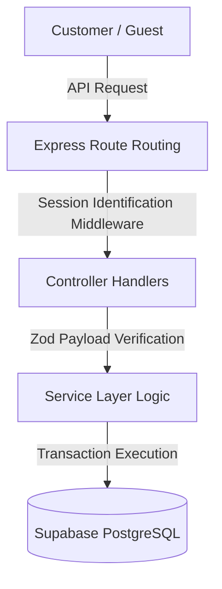
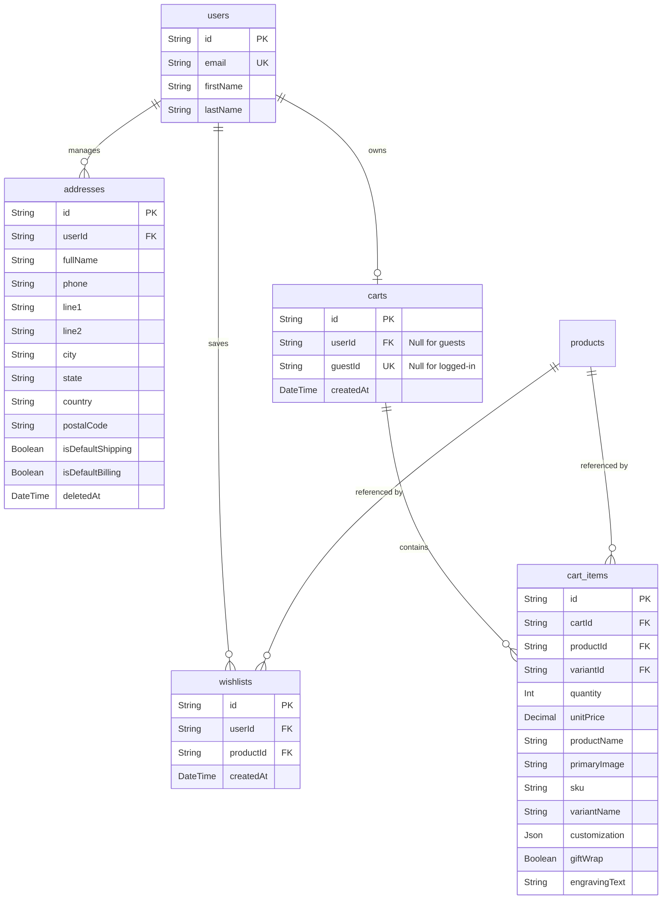

# Phase 4B: Customer Commerce Foundation Technical Implementation Report

## 1. Overview

### 1.1 Purpose of Phase 4B
The Phase 4B Customer Commerce Foundation establishes the persistent commerce layers necessary for cart management, personal wishlists, and address books. By shifting these capabilities from client-side mock memory to centralized, database-backed microservices, Two Threads Studio achieves a unified checkout preparation pipeline.

### 1.2 Business Goals
*   **Frictionless Cart-to-Checkout Pipeline**: Enable shoppers to add items, personalize them with engravings or gift wraps, and configure addresses seamlessly.
*   **Customer Retention**: Offer persistent wishlists that sync across all logged-in devices to drive conversion.
*   **Unified Guest Experience**: Allow anonymous users to build carts and preserve their selections during registration and authentication.

### 1.3 Commerce Goals
*   **Cart Customizations**: Store custom artisan features (gift wrapping, engraving texts, sizing variants) within the permanent cart ledger.
*   **Accuracy in Totals**: Perform real-time calculation of subtotal, tax, shipping, discounts, and grand totals directly on the backend to avoid price manipulation.
*   **Inventory Safety**: Prevent customers from ordering products beyond active inventory limits.

### 1.4 Architecture Summary
The Phase 4B commerce architecture maps persistent tables directly to domain-driven Express 5 handlers, utilizing relational foreign key cascades on deletion.



---

## 2. Features Implemented

### 2.1 Address Book
*   **Full CRUD**: List, add, modify, and soft-delete user addresses.
*   **Default Flag Toggling**: Mark defaults for Shipping and Billing (only one shipping/billing default per user). Setting a new default clears previous defaults.
*   **Smart Fallbacks**: Soft-deleting a default address automatically designates the most recently added address as the new default.

### 2.2 Wishlist
*   **Duplicate Prevention**: Uniqueness constraints on `(userId, productId)` prevent duplicate records.
*   **Move to Cart**: Transfers an item from the wishlist directly into the shopping cart, automatically applying chosen variants and customizations.

### 2.3 Shopping Cart
*   **Dual Session Support**: Standardized parameters supporting both authenticated users (`userId`) and anonymous sessions (`guestId`).
*   **Price Snapshotting**: Saves the product's unit price to `CartItem` dynamically to protect the cart from retroactive catalog price shifts.
*   **Consolidated Item Merging**: Adding matching product/variant combinations consolidates quantities instead of creating separate rows.

### 2.4 Cart Merging
*   **Auto-Merge on Login**: On login, guest cart items merge into the authenticated user's cart. Matches consolidate quantities, and the guest cart is deleted.

---

## 3. Database Schema & ER Diagram



### 3.1 Unique Constraints & Indexes
*   **Wishlist Uniqueness**: `@@unique([userId, productId])` prevents multiple wishlist records for the same product.
*   **Cart Item Uniqueness**: `@@unique([cartId, productId, variantId])` ensures matching variants merge correctly.
*   **Carts Constraints**: `userId` and `guestId` are defined as `@unique` to ensure one active cart per session.
*   **Address Indexes**: `@@index([userId])` improves query performance when retrieving user address books.

### 3.2 Cascading Rules
*   **`onDelete: Cascade`** is enforced on `addresses`, `wishlists`, `carts`, and `cart_items` relative to the parent `User` and `Cart` records to prevent orphaned database records.

---

## 4. API Documentation

### 4.1 Address Book APIs

#### Get All Addresses
*   **Method**: `GET`
*   **URL**: `/api/v1/addresses`
*   **Authentication**: Required (JWT Bearer Token)
*   **Success Response (200 OK)**:
    ```json
    {
      "success": true,
      "addresses": [
        {
          "id": "addr_id",
          "fullName": "Jane Doe",
          "phone": "9876543210",
          "line1": "Flat 402, Royal Gardens",
          "city": "Bengaluru",
          "state": "Karnataka",
          "country": "India",
          "postalCode": "560001",
          "type": "HOME",
          "isDefaultShipping": true,
          "isDefaultBilling": true
        }
      ]
    }
    ```

#### Create Address
*   **Method**: `POST`
*   **URL**: `/api/v1/addresses`
*   **Authentication**: Required
*   **Request Body**:
    ```json
    {
      "fullName": "Jane Doe",
      "phone": "9876543210",
      "line1": "Flat 402, Royal Gardens",
      "city": "Bengaluru",
      "state": "Karnataka",
      "country": "India",
      "postalCode": "560001",
      "type": "HOME"
    }
    ```
*   **Validation**: Enforces Indian PIN formatting (6 digits) and phone validations.

#### Delete Address (Soft Delete)
*   **Method**: `DELETE`
*   **URL**: `/api/v1/addresses/:id`
*   **Success Response**:
    ```json
    {
      "success": true,
      "message": "Address removed successfully."
    }
    ```

---

### 4.2 Wishlist APIs

#### Get Wishlist
*   **Method**: `GET`
*   **URL**: `/api/v1/wishlist`
*   **Success Response**: Array of wishlisted items with product details.

#### Add to Wishlist
*   **Method**: `POST`
*   **URL**: `/api/v1/wishlist`
*   **Request Body**:
    ```json
    {
      "productId": "prod_cuid"
    }
    ```

#### Move Wishlist Item to Cart
*   **Method**: `POST`
*   **URL**: `/api/v1/wishlist/:productId/move-to-cart`
*   **Request Body** (Optional):
    ```json
    {
      "variantId": "variant_cuid",
      "quantity": 1
    }
    ```

---

### 4.3 Shopping Cart APIs

#### Get Cart
*   **Method**: `GET`
*   **URL**: `/api/v1/cart`
*   **Headers** (For Guests): `x-guest-id: guest_uuid`
*   **Success Response**:
    ```json
    {
      "success": true,
      "cart": {
        "id": "cart_id",
        "items": [
          {
            "id": "item_id",
            "productId": "prod_id",
            "quantity": 1,
            "unitPrice": 120.00,
            "totalPrice": 120.00,
            "productName": "Aran Sweater",
            "primaryImage": "https://...",
            "giftWrap": false,
            "availableStock": 15
          }
        ],
        "totals": {
          "subtotal": 120.00,
          "discount": 0.00,
          "shipping": 0.00,
          "tax": 0.00,
          "grandTotal": 120.00,
          "totalItems": 1
        }
      }
    }
    ```

#### Add Cart Item
*   **Method**: `POST`
*   **URL**: `/api/v1/cart/items`
*   **Request Body**:
    ```json
    {
      "productId": "prod_id",
      "variantId": "variant_id",
      "quantity": 1,
      "giftWrap": true,
      "engravingText": "Love Forever"
    }
    ```

---

## 5. Core Commerce Logic

### 5.1 Price Snapshots
To prevent retroactive catalog price changes from altering existing cart costs, Two Threads Studio saves a snapshot of the unit price directly to the `CartItem` table upon insertion or quantity updates:
```typescript
const priceAdjustment = variant ? Number(variant.priceAdjustment) : 0;
const finalPrice = Number(product.price) + priceAdjustment;
// Saved in DB as cartItem.unitPrice
```

### 5.2 Stock & Inventory Validation
The cart service monitors product stock availability during insertion or quantity updates:
1.  **Check `trackInventory`**: If `false`, inventory tracking is bypassed (defaulting available stock to 999).
2.  **Verify Inventory Levels**: If `true`, the system queries the database to compare requested quantities against available stock:
    ```typescript
    const availableStock = variant ? variant.stockQuantity : product.stockQuantity;
    if (availableStock < targetQuantity) {
      throw new AppError(`Insufficient inventory. Only ${availableStock} items left in stock.`, 400);
    }
    ```

### 5.3 Guest Cart Merging Flow
Managed atomically using a database transaction:
*   Queries active guest items by `guestId`.
*   Iterates through each guest item to check for matches in the user's permanent cart.
*   If a match is found, quantities are combined; otherwise, the guest item is cloned to the user's cart.
*   Deletes the guest items and the temporary cart record to clean up storage.

---

## 6. Frontend Commerce UI Integration

### 6.1 State Management (TanStack Query Mutations)
Commerce queries and mutations are managed in `frontend/src/hooks/useCommerce.ts`:
*   **Queries**: `useCart`, `useWishlist`, and `useAddresses` automatically handle query keys and states.
*   **Cache Invalidation**: Mutations automatically invalidate stale queries:
    ```typescript
    onSuccess: () => {
      queryClient.invalidateQueries({ queryKey: ['cart'] });
    }
    ```

### 6.2 Components
*   **AddressBook** (`AddressBook.tsx`): Form for managing billing and shipping addresses.
*   **AddressSelector** (`AddressSelector.tsx`): Displays default shipping/billing cards during checkout and allows selection.
*   **WishlistTab** (`WishlistTab.tsx`): Tab on the account page that lists saved items and supports quick add-to-cart transfers.

---

## 7. Performance & Query Optimization

*   **Avoid N+1 Queries**: Relational includes are queried in a single database round-trip:
    ```typescript
    include: {
      items: {
        include: {
          product: {
            include: {
              images: { where: { isPrimary: true } }
            }
          }
        }
      }
    }
    ```
*   **Compound Indexes**: Created database indexes for frequent query paths (e.g., matching cart items by `cartId`, `productId`, and `variantId`).

---

## 8. Folder Structure

```
├── backend/
│   ├── src/
│   │   ├── controllers/
│   │   │   ├── address.controller.ts
│   │   │   ├── cart.controller.ts
│   │   │   └── wishlist.controller.ts
│   │   ├── routes/
│   │   │   ├── address.routes.ts
│   │   │   ├── cart.routes.ts
│   │   │   └── wishlist.routes.ts
│   │   ├── services/
│   │   │   ├── address.service.ts
│   │   │   ├── cart.service.ts
│   │   │   └── wishlist.service.ts
│   │   └── validators/
│   │       ├── address.validator.ts
│   │       ├── cart.validator.ts
│   │       └── wishlist.validator.ts
└── frontend/
    ├── src/
    │   ├── components/
    │   │   └── commerce/
    │   │       └── AddressSelector.tsx
    │   ├── hooks/
    │   │   └── useCommerce.ts
    │   └── pages/
    │       └── Account/
    │           ├── AddressBook.tsx
    │           └── WishlistTab.tsx
```

---

## 9. Future Improvements

*   **Coupon Code Support**: Enhance total calculations on the backend to support discounts from coupon codes.
*   **Dynamic Shipping & Tax Estimation**: Connect API endpoints to shipping carriers and tax calculators to compute exact totals dynamically before final checkout.

---

## 10. Conclusion

Phase 4B successfully implements the core commerce infrastructure for Two Threads Studio. Shifting cart, wishlist, and address management to a database-backed API ensures a secure, reliable, and consistent experience for customers preparing to complete their purchases.
