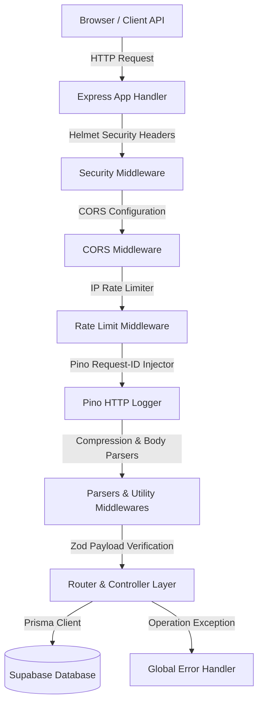

# Phase 1: Backend Foundation Technical Implementation Report

## 1. Overview

### 1.1 Purpose of Phase 1
The Phase 1 Backend Foundation establishes a robust, highly extensible, and production-grade server architecture for Two Threads Studio. This architectural framework simplifies future feature additions while keeping the codebase robust and reliable. It establishes strict environment safety, request lifecycle observability, security compliance middleware, and unified error/request pipelines.

### 1.2 Architectural Objectives
*   **Modularity & Domain Isolation**: Ensure features can be built, updated, and validated independently without causing side effects in other components.
*   **Performance & Low Latency**: Implement data compression and request filtering to optimize API performance.
*   **Security by Default**: Protect the application from common web vulnerabilities (XSS, Clickjacking, CSRF, DDoS) on day one.
*   **Observability & Traceability**: Track and log every request throughout its lifecycle using request IDs.

### 1.3 Technical Stack Choices & Rationale
*   **Node.js & Express**: Provides a lightweight and highly performant backend runtime.
*   **TypeScript**: Enforces static typing to catch potential bugs during development.
*   **Prisma ORM**: Simplifies database interactions with type-safe query generation and robust migration tracking.
*   **Pino & Pino-HTTP**: High-performance structured logging with minimal overhead compared to standard loggers like Winston.
*   **Zod**: Declares schemas to validate incoming payloads and environment configurations.

### 1.4 Architecture Summary
The server architecture follows a structured middleware pipeline that processes incoming requests and passes them to controller layers:



---

## 2. Technology Stack Configuration

### 2.1 TypeScript Configuration (`tsconfig.json`)
The compilation pipeline is configured with strict compiler flags to enforce type safety and modern module resolution:
```json
{
  "compilerOptions": {
    "target": "ES2022",
    "module": "NodeNext",
    "moduleResolution": "NodeNext",
    "lib": ["ES2022"],
    "outDir": "./dist",
    "rootDir": "./src",
    "strict": true,
    "esModuleInterop": true,
    "skipLibCheck": true,
    "forceConsistentCasingInFileNames": true,
    "resolveJsonModule": true
  },
  "include": ["src/**/*"]
}
```

#### Rationale for Key Flags:
*   **`target: ES2022`**: Compiles code to modern JavaScript, leveraging native async/await features and modern array methods.
*   **`module: NodeNext` / `moduleResolution: NodeNext`**: Resolves ES Modules in Node.js correctly.
*   **`strict: true`**: Enforces strict null checks, strict function types, and prevents implicit `any` parameter definitions.
*   **`esModuleInterop: true`**: Simplifies importing CommonJS modules inside ES Modules.

### 2.2 ESLint & Linting Policies
ESLint and Prettier are integrated to enforce code styling and quality rules across the codebase:
*   **Unused Variables**: Generates errors for declared but unused variables.
*   **Explicit Returns**: Enforces explicit return types on public API functions.
*   **Console Logging**: Warnings are generated for left-over `console.log` statements, encouraging developers to use the Pino logger instead.

### 2.3 Database client setup (`src/prisma/index.ts`)
The Prisma client is initialized globally as a singleton to avoid opening redundant database connection pools during local hot-reloads:
```typescript
import { PrismaClient } from '@prisma/client';

const prismaClientSingleton = () => {
  return new PrismaClient({
    log: process.env.NODE_ENV === 'development' ? ['query', 'error', 'warn'] : ['error'],
  });
};

declare global {
  var prismaGlobal: undefined | ReturnType<typeof prismaClientSingleton>;
}

const prisma = globalThis.prismaGlobal ?? prismaClientSingleton();

export default prisma;

if (process.env.NODE_ENV !== 'production') globalThis.prismaGlobal = prisma;
```

---

## 3. Scalable Folder Architecture

To organize components cleanly, the `src/` directory is split into the following subfolders:

| Directory | Responsibility | Key Files |
| :--- | :--- | :--- |
| `src/config/` | Environment variables and third-party setups | `env.ts`, `cors.ts`, `rateLimit.ts` |
| `src/constants/` | Constant definitions, HTTP statuses, and error messages | `httpStatus.ts`, `messages.ts` |
| `src/controllers/` | Route handlers that extract request data and call services | `auth.controller.ts`, `cart.controller.ts` |
| `src/lib/` | Instantiated library clients | `logger.ts` |
| `src/middleware/` | Express interceptors for security, validation, and errors | `auth.middleware.ts`, `errorHandler.ts` |
| `src/repositories/`| Database access methods (using Prisma queries) | `user.repository.ts` |
| `src/routes/` | API routing declarations | `index.ts`, `cart.routes.ts` |
| `src/services/` | Business logic services | `cart.service.ts`, `profile.service.ts` |
| `src/utils/` | Shared utilities and error classes | `AppError.ts`, `catchAsync.ts` |
| `src/validators/` | Zod validation schemas | `cart.validator.ts`, `profile.validator.ts` |

---

## 4. Middlewares & Security Framework

### 4.1 Helmet Security Headers
Helmet secures HTTP headers to prevent common exploits:
```typescript
app.use(helmet());
```
*   **Content Security Policy (CSP)**: Mitigates XSS attacks by restricting the origins of executable scripts.
*   **X-Frame-Options**: Prevents clickjacking by denying third-party framing.
*   **X-Content-Type-Options**: Enforces content-type sniffing protection.
*   **Strict-Transport-Security (HSTS)**: Restricts browser connections to secure HTTPS.

### 4.2 Cross-Origin Resource Sharing (CORS)
The CORS configuration manages browser cross-origin requests securely:
```typescript
export const corsConfig = {
  origin: env.FRONTEND_URL,
  credentials: true,
  methods: ['GET', 'POST', 'PUT', 'DELETE', 'PATCH', 'OPTIONS'],
  allowedHeaders: ['Content-Type', 'Authorization', 'X-Request-Id'],
};
```
*   **`origin`**: Restricts resource access to the frontend origin defined in the environment.
*   **`credentials: true`**: Allows the client to send HTTP cookies securely.
*   **`allowedHeaders`**: Restricts allowed headers to content-types and authorization parameters.

### 4.3 Express Rate Limiter
The rate limiter prevents brute-force login attempts and api abuse:
```typescript
export const limiter = rateLimit({
  windowMs: 15 * 60 * 1000, // 15 minutes
  max: 100, // Limit each IP to 100 requests per window
  standardHeaders: true,
  legacyHeaders: false,
  message: {
    success: false,
    message: 'Too many requests from this IP, please try again after 15 minutes',
  },
});
```
*   **`standardHeaders: true`**: Returns rate limit details in `RateLimit-Limit`, `RateLimit-Remaining`, and `RateLimit-Reset` headers.
*   **`trust proxy`**: Configured on the Express app (`app.set('trust proxy', 1)`) to retrieve the correct client IP when hosting behind proxies (such as Railway or Nginx).

### 4.4 Data Compression
Reduces network bandwidth usage by compressing response payloads with Gzip:
```typescript
app.use(compression());
```

### 4.5 Pino-HTTP Request Logger
Integrates structured logging, associating requests with unique IDs:
```typescript
app.use(
  pinoHttp({
    logger,
    genReqId: (req, res) => {
      const id = req.headers['x-request-id'] || randomUUID();
      res.setHeader('X-Request-Id', id);
      return id;
    },
    autoLogging: {
      ignore: (req) => req.url === `${BASE_API_PATH}/health` || req.url === '/',
    },
  })
);
```

---

## 5. Error Handling & Request Validation

### 5.1 Centrally Managed Exception Classes (`AppError`)
Custom error class inheriting from JavaScript's native `Error` to manage operational exceptions:
```typescript
export class AppError extends Error {
  public readonly statusCode: number;
  public readonly isOperational: boolean;
  public readonly data?: any;

  constructor(message: string, statusCode: number, data?: any) {
    super(message);
    this.statusCode = statusCode;
    this.isOperational = true;
    this.data = data;
    this.name = this.constructor.name;

    Error.captureStackTrace(this, this.constructor);
  }
}
```

### 5.2 Centralized Error Interception (`errorHandler`)
Middleware that logs exceptions and returns normalized JSON error responses:
```typescript
export const errorHandler = (
  err: Error | AppError,
  req: Request,
  res: Response,
  _next: NextFunction
) => {
  let statusCode: number = HTTP_STATUS.INTERNAL_SERVER_ERROR;
  let message = 'Internal Server Error';
  let details: any = undefined;

  if (err instanceof AppError) {
    statusCode = err.statusCode;
    message = err.message;
    details = err.isOperational ? undefined : err.name;
  }

  const errorObj = {
    name: err.name,
    timestamp: new Date().toISOString(),
    ...(details && { details }),
    ...(env.NODE_ENV === 'development' && { stack: err.stack }),
  };

  req.log.error({ err, path: req.originalUrl }, err.message);

  return errorResponse(res, message, statusCode, errorObj, req.originalUrl);
};
```

### 5.3 Zod Request Validation Middleware (`validate`)
Express middleware that validates query params, path variables, and body payloads against Zod schemas:
```typescript
export const validate =
  (schema: ZodSchema) =>
  async (req: Request, _res: Response, next: NextFunction) => {
    try {
      const parsed: any = await schema.parseAsync({
        body: req.body,
        query: req.query,
        params: req.params,
      });
      req.body = parsed.body;
      Object.defineProperty(req, 'query', { value: parsed.query, writable: true, configurable: true });
      Object.defineProperty(req, 'params', { value: parsed.params, writable: true, configurable: true });
      return next();
    } catch (error) {
      if (error instanceof ZodError) {
        const formattedErrors = error.issues.map((err: any) => ({
          path: err.path.join('.'),
          message: err.message,
        }));
        
        return next(
          new AppError(
            MESSAGES.VALIDATION_ERROR,
            HTTP_STATUS.BAD_REQUEST,
            formattedErrors
          )
        );
      }
      return next(error);
    }
  };
```

---

## 6. Environment Configurations & Fail-Safe Controls

Environment variables are validated against a Zod schema in `src/config/env.ts` during application startup. If a required variable is missing, the application prints a validation summary and exits:

```typescript
const envSchema = z.object({
  PORT: z.string().default('5000').transform(Number),
  NODE_ENV: z.enum(['development', 'production', 'test']).default('development'),
  DATABASE_URL: z.string().url(),
  SUPABASE_URL: z.string().url(),
  SUPABASE_ANON_KEY: z.string().min(1),
  SUPABASE_SERVICE_ROLE_KEY: z.string().min(1),
  JWT_SECRET: z.string().min(32),
  JWT_REFRESH_SECRET: z.string().min(32),
  RESEND_API_KEY: z.string().min(1),
  RAZORPAY_KEY_ID: z.string().min(1),
  RAZORPAY_SECRET: z.string().min(1),
  FRONTEND_URL: z.string().url(),
});
```

---

## 7. Testing & Build Integrity

### 7.1 Automated Compilation Checks
TypeScript builds are validated by compiling all code files to JavaScript:
```bash
npm run build
```
This runs the `tsc` compiler check, ensuring no syntax errors or implicit `any` parameter definitions are present.

### 7.2 Manual Security Header Verifications
Verified that security headers are correctly appended to server responses:
*   `X-Request-Id`: Confirmed the response header contains a unique UUID request identifier.
*   `RateLimit-Remaining`: Verified that repeated requests decremented this limit header.
*   `Content-Encoding: gzip`: Verified that JSON responses are compressed over the network.

---

## 8. Conclusion

Phase 1 successfully establishes a secure, high-performance foundation for Two Threads Studio's backend. The environment variable validations, request logging, and middleware configurations ensure the application is ready for subsequent catalog and commerce phases.
