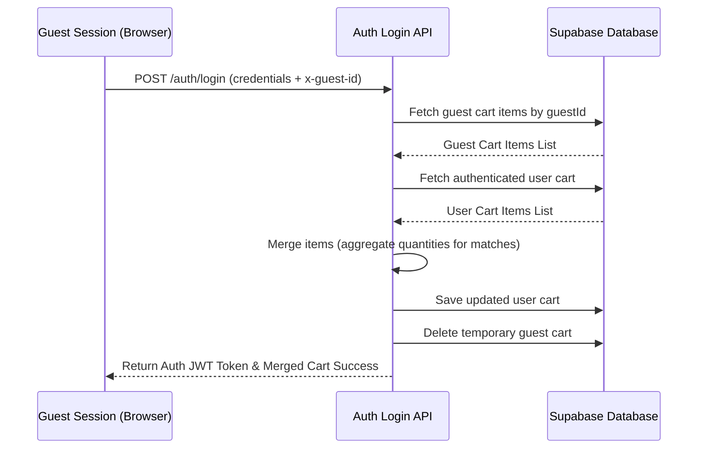

# Phase 4: Customer Identity & Commerce Foundation

## Objective
To establish a fully functional, production-ready Customer Commerce and Profile foundation. This phase replaces all mock/local persistence with a secure Supabase PostgreSQL database, Prisma ORM data models, robust Express middleware, and a TanStack React Query state management frontend layer.

---

## Part A: Customer Identity & Profile Experience

### 1. Database Schema Extensions
Extended the Prisma `User` model to capture full demographic, preference, and marketing consent parameters:
*   `firstName` / `lastName`: Client personalization data.
*   `phone`: Validated contact numbers.
*   `avatarUrl`: Path to user profiles or media assets.
*   `gender` / `dateOfBirth`: Demographic attributes for catalog tailoring.
*   `preferredLanguage`: Preference configuration (e.g., `en`, `hi`).
*   `newsletterSubscribed` / `marketingConsent`: Marketing telemetry consent flags.

### 2. Backend Profiles & Security Endpoints (`/api/v1/profile`)
*   `GET /`: Fetches complete current profile details of the authenticated client.
*   `PUT /`: Updates user settings (phone, language, consent flags) using Zod validator constraints.
*   `GET /dashboard`: Computes real-time overview metrics:
    *   `customerName`: Formatted display name.
    *   `memberSince`: Format-adjusted enrollment date.
    *   `cartCount`: Total items in the user's active cart database entry.
    *   `wishlistCount`: Total items saved to the user's wishlist repository.
    *   `savedAddresses`: Total count of active addresses in their Address Book.
    *   `recommendedProducts`: Handpicked products fetched dynamically from the database.
*   `POST /auth/logout-all` (Security): Revokes all refresh tokens and sessions associated with the user.

---

## Part B: Customer Commerce Infrastructure

### 1. Database Relational Models
Designed relational database models to represent commerce entities:
*   `Address`: Multi-address ledger linked to `User`. Separate flags for `isDefaultShipping` and `isDefaultBilling`. Auto-formats regions and handles Indian addresses.
*   `Wishlist`: Schema uniqueness mapping `userId` to `productId` to prevent duplicate rows.
*   `Cart` & `CartItem`: Persistent user shopping cart records. Captures price snapshots, quantities, and personalization choices (`customization` JSON, `giftWrap`, `engravingText`).

### 2. Commerce APIs & Request Validations

#### Address Book (`/api/v1/addresses`)
*   `GET /`: Retrieves all addresses saved under the user.
*   `POST /`: Creates an address entry. Performs region validation (e.g., Indian PIN and phone verification).
*   `PUT /:id`: Edits street addresses, landmarks, or contact names.
*   `PATCH /:id/default`: Designates an address as default shipping, default billing, or both, clearing previous defaults.
*   `DELETE /:id`: Removes address records.

#### Wishlist (`/api/v1/wishlist`)
*   `GET /`: Fetches wishlist products.
*   `POST /`: Adds a product if not already wishlisted.
*   `DELETE /:productId`: Deletes a product from the list.
*   `POST /:productId/move-to-cart`: Transfers the wishlisted item to the active cart.

#### Shopping Cart (`/api/v1/cart`)
*   `GET /`: Returns the cart along with computed cost aggregates:
    *   `subtotal`, `discount`, `shipping`, `tax`, `grandTotal`, and `totalItems`.
*   `POST /items`: Adds products/variants to the cart. If a identical variant with the same customization/engraving exists, quantities merge instead of creating a duplicate row.
*   `PATCH /items/:id`: Dynamically scales item quantities and updates customization choices, validating stock levels against the database.
*   `DELETE /items/:id`: Deletes items from the cart.
*   `DELETE /`: Clears all cart contents.

---

## Technical Integration & Design Architectures

### 1. Guest-to-User Cart Merging Workflow
Allows clients to add items without logging in. The system attaches a unique, client-side generated `x-guest-id` UUID header to public requests. 
When a login event (`POST /api/v1/auth/login`) succeeds:
1. The backend automatically queries for items belonging to the active `guestId`.
2. Any items found are merged into the client's database-backed user cart.
3. If duplicate variant/customization combinations are detected, their quantities are consolidated.
4. Guest database cart assets are cleared.

### 2. Frontend State Synchronization
*   **TanStack React Query Provider**: Configured in `App.tsx` to handle cache invalidation and query retries automatically.
*   **Universal API Client**: Standardized HTTP handling, request/response headers (JWT and Guest ID headers), and exception bubbling.
*   **Apple-Inspired Dashboard Layout**: A clean side-nav dashboard comprising three interactive sub-pages:
    *   **Overview**: User cards, summary indicators, and recommendation lists.
    *   **Profile**: Fields updating in-database preferences.
    *   **Address Book**: Interactive cards handling default addresses and additions.

---

## Verification & Build Integrity
*   **TypeScript Checks**: The frontend and backend directories compile without warning or implicit `any` parameter exceptions.
*   **Integration Integrity**: Handled Expression 5 dynamic route parameters and Zod payload decoders safely.
