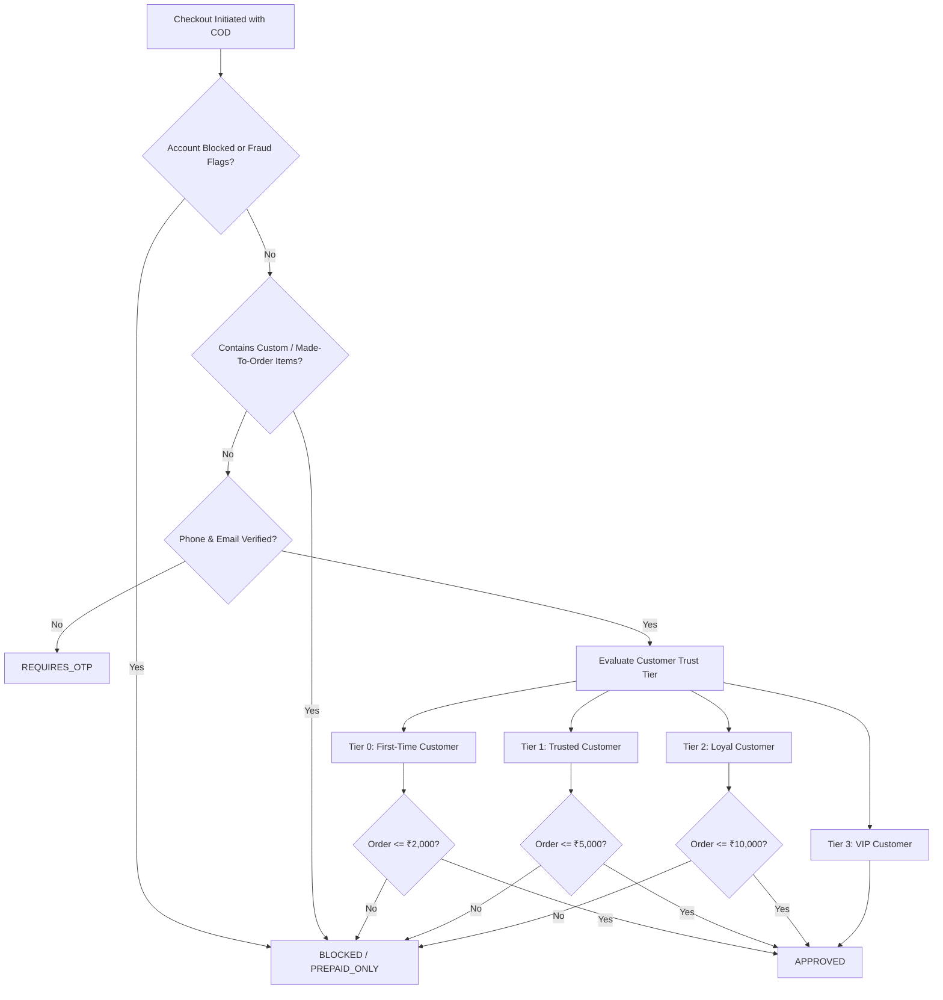
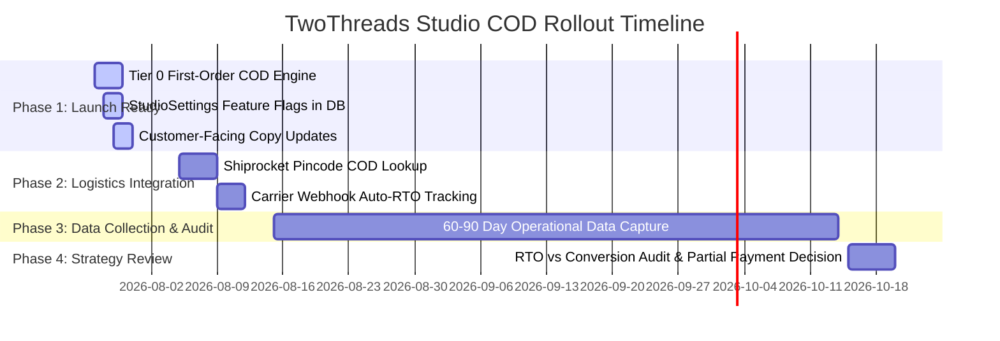

Below is the **Strategic Implementation Architecture Blueprint** for **COD Policy 2.0**, designed with zero hardcoded parameters, feature-flag-ready database fields, and data-driven operational checkpoints.

---

## 1. COD Policy 2.0 Matrix & Customer Tiers

Instead of binary block/allow rules, COD eligibility scales progressively based on verified customer trust:



### Tier Breakdown

| Tier | Customer Requirements | COD Order Limit | OTP Policy |
| :--- | :--- | :--- | :--- |
| **Tier 0 (New)** | 0 delivered orders, Phone OTP verified, Email verified, Trust score 50 | **₹2,000** | Required (First-order SMS OTP) |
| **Tier 1 (Trusted)**| 1+ delivered orders, 0 RTOs, Trust score $\ge$ 50 | **₹5,000** | Optional / Risk-triggered |
| **Tier 2 (Loyal)**  | 3+ delivered orders, 0 RTOs, Trust score $\ge$ 70 | **₹10,000** | Bypassed |
| **Tier 3 (VIP)**    | 5+ delivered orders, 0 RTOs, Trust score $\ge$ 85 | **Configurable (e.g., ₹25,000)** | Bypassed + Priority Dispatch |

---

## 2. Dynamic Settings Schema (Feature Flags)

To avoid hardcoded constants like `COD_MAX_ORDER_VALUE = 2500` inside source files, we extend the existing `StudioSettings` Prisma model. This allows administrators to adjust limits during peak artisan campaigns or seasonal sales straight from the Admin Dashboard without deploying new code.

### Proposed Schema Extension (`prisma/schema.prisma`)

```prisma
model StudioSettings {
  id                     String   @id @default(cuid())
  singleton              Boolean  @unique @default(true)

  // ── Existing COD Rules ────────────────────
  codEnabled             Boolean  @default(true)
  codMaxOrderValue       Decimal  @default(5000) @db.Decimal(10, 2)
  codExtraCharge         Decimal  @default(0)    @db.Decimal(10, 2)
  prepaidDiscountPercent Decimal  @default(5)    @db.Decimal(5, 2)

  // ── COD Policy 2.0 Dynamic Feature Flags ──
  allowFirstOrderCod     Boolean  @default(true)
  firstOrderCodLimit     Decimal  @default(2000) @db.Decimal(10, 2)
  trustedCustomerCodLimit Decimal @default(5000) @db.Decimal(10, 2)
  loyalCustomerCodLimit  Decimal  @default(10000) @db.Decimal(10, 2)
  vipCustomerCodLimit    Decimal  @default(25000) @db.Decimal(10, 2)

  requirePhoneVerification Boolean @default(true)
  requireEmailVerification Boolean @default(false)
  codOtpRequired           Boolean @default(true)
}
```

---

## 3. Revised Refactoring Roadmap (Phased Approach)

Postponing **Partial Advance COD** until 60–90 days post-launch preserves lean checkout velocity and avoids unnecessary customer friction.



### Action Items & Milestones

1. **Milestone 1 (Pre-Launch)**: 
   - Replace the rigid `ordersPlaced === 0` rule in `CodEligibilityEngine.ts` with Tier 0 logic (`allowFirstOrderCod && orderTotal <= firstOrderCodLimit`).
   - Wire thresholds to `StudioSettings` singletons.
   - Refine UI messages in `Checkout.tsx` to clearly explain limits (e.g., *"COD is available for initial orders up to ₹2,000 with phone verification"*).
2. **Milestone 2 (Integration)**: 
   - Add live pincode serviceability checks against Shiprocket APIs during the address/shipping checkout steps.
3. **Milestone 3 (Post-Launch Audit Window)**:
   - Monitor 60–90 days of operational metrics: **RTO Rate**, **Doorstep Refusal Rate**, and **Average Order Value (AOV)**.
   - Evaluate whether Partial Advance (e.g., charging ₹150 online shipping before dispatching COD) is necessary based on empirical data rather than early assumptions.