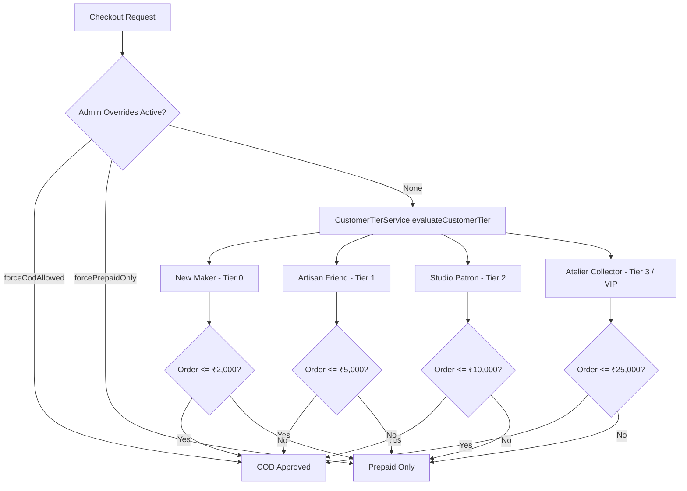

# COD Policy 2.0 Specification & Architecture Report
**Two Threads Studio E-Commerce System**  
**Author**: Senior Software Documentation Engineer & Technical Architect  
**Status**: Approved & Implemented Baseline (Version 2.1)  

---

## 1. Executive Summary

COD Policy 2.0 shifts Two Threads Studio from a generic fraud-prevention filter into an **editorial-aligned, progressive trust system**. 

Rather than penalizing new visitors with binary blocks, the platform balances **customer acquisition trust** with **artisan brand protection**. It introduces configurable customer tiers, dynamic feature flags, lifetime spend metrics, and administrative concierges.

---

## 2. Customer Tier Architecture (Editorial Progression)

Classification logic is centralized in `backend/src/services/CustomerTierService.ts`.

### Customer Tiers Summary

| Technical Key | Display Name (Editorial) | Requirement Criteria | Dynamic COD Limit | OTP Policy |
| :--- | :--- | :--- | :--- | :--- |
| `NEW_MAKER` | **New Maker** | Default for initial accounts (0 delivered orders) | **₹2,000** (`firstOrderCodLimit`) | Required (SMS OTP) |
| `ARTISAN_FRIEND` | **Artisan Friend** | 1+ delivered order, 0 RTOs, Trust score $\ge 50$ | **₹5,000** (`trustedCustomerCodLimit`) | Risk-triggered |
| `PATRON` | **Studio Patron** | 3+ delivered orders OR Lifetime Spend $\ge ₹15,000$, 0 RTOs | **₹10,000** (`loyalCustomerCodLimit`) | Bypassed |
| `ATELIER_COLLECTOR` | **Atelier Collector** | 5+ delivered orders OR Lifetime Spend $\ge ₹40,000$, 0 RTOs | **₹25,000** (`vipCustomerCodLimit`) | Bypassed + Priority Dispatch |

---

## 3. Dynamic Feature Flags (`StudioSettings`)

All business limits and thresholds are retrieved directly from the single-row `StudioSettings` table (`prisma/schema.prisma`), enabling instant policy updates without code deployments:

- **Limits**: `firstOrderCodLimit` (₹2,000), `trustedCustomerCodLimit` (₹5,000), `loyalCustomerCodLimit` (₹10,000), `vipCustomerCodLimit` (₹25,000).
- **Trust Thresholds**: `tier1TrustScore` (50), `tier2TrustScore` (70), `tier3TrustScore` (85).
- **Spend Thresholds**: `tier2LifetimeSpendINR` (₹15,000), `tier3LifetimeSpendINR` (₹40,000).
- **Feature Flags**: `allowFirstOrderCod` (true), `requirePhoneVerification` (true), `requireEmailVerification` (false), `codOtpRequired` (true).

---

## 4. Admin Concierge Overrides

To accommodate high-value clients, interior designers, or special concierge requests, the `CustomerRisk` schema includes override flags:

1. `forceCodAllowed` (`Boolean`): Instantly bypasses tier limit and trust score checks to approve COD.
2. `forcePrepaidOnly` (`Boolean`): Restricts an account strictly to prepaid methods regardless of order history.
3. `tierOverride` (`String`): Manually assigns an editorial tier (e.g., forcing `ATELIER_COLLECTOR` status).
4. `adminOverrideReason` (`String`): Audit note explaining why an exception was granted.

---

## 5. Day-1 Telemetry & 60-90 Day Data Audit Strategy

Partial advance payments (e.g., charging ₹150 online before dispatch) are explicitly deferred until 60–90 days post-launch. 

Starting on Day 1, all checkout events log complete telemetry payloads in `OrderAuditLog.details`:

- `paymentMethod` (`COD` / `ONLINE`)
- `customerTier` (`NEW_MAKER`, `ARTISAN_FRIEND`, `PATRON`, `ATELIER_COLLECTOR`)
- `trustScore` & `totalLifetimeSpend`
- `postalCode` & carrier serviceability
- `rtoRiskScore` & fraud flags

After 60–90 days of operational data, the team will review:
1. **COD Conversion Rate**
2. **RTO Percentage**
3. **Doorstep Refusal Rate**
4. **Average Order Value (AOV)**

If RTO exceeds 10% or high-value refusal spikes, Partial Advance COD can be enabled with clear empirical justification.

---

## 6. Codebase File Inventory

- `backend/prisma/schema.prisma`: Schema definitions for `CustomerRisk` and `StudioSettings`.
- `backend/src/services/CustomerTierService.ts`: Central tier evaluation module.
- `backend/src/engines/CodEligibilityEngine.ts`: Updated rule engine evaluating customer tiers, feature flags, and product rules.
- `backend/src/engines/RiskEngine.ts`: Risk evaluation orchestrator passing settings and customer tiers.
- `backend/src/services/risk.service.ts`: Data integration layer connecting DB singletons to risk engines.
- `frontend/src/pages/Checkout.tsx`: Frontend UI rendering warm, editorial COD notice cards and handling OTP verification.
