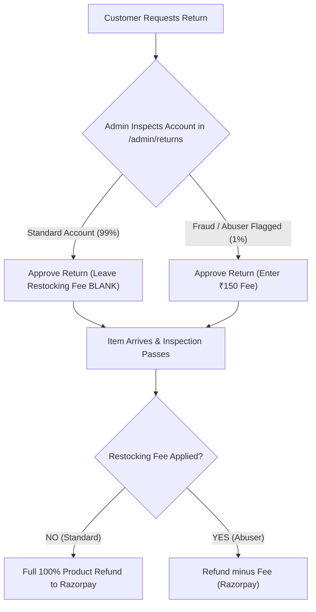

# 📘 Standard Operating Procedure (SOP): Product Pricing, Tiered Shipping & Returns Management

**Organization**: Two Threads Studio  
**Target Audience**: Catalog Managers, Customer Support, Order Fulfillment & Finance Operations  
**Effective Date**: August 2026  
**Document Version**: 2.0 (Enterprise Blended Margin & Customer Delight Model)

---

## 1. Executive Summary & Core Philosophy

At Two Threads Studio, our operational strategy is built on two core pillars:
1. **Customer Delight**: Customers should experience zero friction during checkout and receive 100% full refunds on standard product returns. They must never see hidden deductions or restocking penalties on their return receipts.
2. **Margin Protection (Blended Recovery)**: We protect our bottom line against courier price hikes and return shipping expenses by embedding a shipping allowance directly into every product's base price, supplemented by tiered checkout delivery charges.

---

## 2. Catalog Pricing SOP (Catalog & Finance Team)

When listing new handcrafted products or updating existing inventory in `/admin/products`, all catalog managers must compute listed prices using the **Blended Margin Formula**:

$$\text{Listed Product Price} = \text{Product Cost} + \text{Artisan Labor} + \text{Overhead} + \text{Target Profit Margin} + \text{Shipping Allowance (~₹150)}$$

### Example Calculation:
* Raw Materials & Kit Packaging: ₹350
* Artisan Labor & Inspection: ₹200
* Studio Overhead & Operations: ₹150
* Target Net Profit Margin: ₹150
* **Base Product Valuation**: ₹850
* **Added Shipping Allowance**: **+₹150**
* **Final Database & Store Price**: **₹1,000**

> [!NOTE]
> **Why do we add the ₹150 allowance to the base price?**  
> Because 90%+ of customers keep their order. The ₹150 allowance creates a pooled cash buffer across all completed sales. This pool automatically pays for courier rate increases and covers the logistics cost of the small percentage of returned orders—without ever needing to penalize returning customers!

---

## 3. Checkout Shipping Fee Tiers (Store & Fulfillment)

Our online store automatically applies tiered delivery rates based on the customer's cart subtotal at checkout:

| Order Subtotal Range | Customer Delivery Charge | Logistics Strategy |
| :--- | :--- | :--- |
| **Under ₹2,000** | **₹149** | Recovers delivery costs on small single-item orders while generating bonus logistics margin. |
| **₹2,000 – ₹4,999** | **₹99** | Incentive tier encouraging customers to add extra embroidery threads or hoops. |
| **₹5,000+** | **FREE** | Premium free shipping tier for high-value orders (covered by built-in product margin pool). |

> [!TIP]
> The checkout sidebar dynamically prompts customers: *"Add ₹X more to get ₹99 shipping"* or *"Add ₹X more for FREE delivery"*. This raises our Average Order Value (AOV).

---

## 4. Return & Refund Processing SOP (Customer Support & Warehouse)

### Policy Overview

---

### A. Standard Return Workflow (99% of Returns — Default Policy)
1. Go to the Admin Portal: Navigate to **Returns Management** (`/admin/returns`).
2. Click **Approve** on the pending return request.
3. **CRITICAL**: **LEAVE THE `Restocking / Return Fee (₹)` FIELD EMPTY**.
4. The customer will receive full status updates ("Return Approved", "Reverse Pickup Scheduled").
5. When the item passes warehouse inspection, the system automatically triggers a **100% full refund** of the product price back to their original payment method via Razorpay.

**Customer Impression**: *"Two Threads Studio issued a fast, 100% full refund with no deductions! I will definitely shop here again."*

---

### B. Flagged Return Workflow (1% Exception — Fraud & Repeat Abusers Only)
1. Check for the `🚨 Fraud Flagged` badge or inspect customer history in `/admin/customers` (e.g. >3 returns in 30 days or item swapping attempts).
2. When clicking **Approve**, enter the designated fee (e.g., `150`) into the **`Restocking / Return Fee (₹)`** field.
3. The system will save this fee and automatically deduct it from the final Razorpay payout after warehouse quality inspection passes.

---

## 5. Step-by-Step Admin Dashboard Quick Reference

| Action | Admin Dashboard Path | Instructions |
| :--- | :--- | :--- |
| **Approve Return** | `/admin/returns` → Select Request → **Approve** | Verify requested amount. **Leave restocking fee blank** for standard returns. |
| **Mark Received** | `/admin/returns` → Select Request → **Mark Received** | Click when courier delivers the returned package to the atelier warehouse. |
| **Quality Check** | `/admin/returns` → Select Request → **Record Inspection** | Mark **Passed** and select **Restock Inventory** to return items to live stock. |
| **Manual Override** | `/admin/orders` → Select Order → **Payment Section** | Use only for manual cash/offline refunds or test accounts. Bypasses Razorpay API. |

---

## 6. Frequently Asked Questions (FAQ)

**Q: Won't we lose money on shipping if we give a 100% full refund on returns?**  
*A: No. Because every product price includes the ₹150 shipping allowance, the 90%+ of customers who keep their order build up a logistics buffer. That buffer easily covers the return shipping cost of the small percentage of returned orders.*

**Q: What if our courier partner raises their rates from ₹90 to ₹120 per package?**  
*A: You don't need to change return rules or upset customers. Simply update the listed product price by ₹30 or update the checkout tier rules. The blended margin model absorbs rate hikes automatically.*

# Q/So if product prices is 1000 ,isnide 1000 the sipping fee is alreday added right ? and then in website while chceout there is 149/- for shipping fee again right ? 
**YES, EXACTLY RIGHT!** 🎯

You have understood the strategy 100% correctly. Here is how those two layers work together in practice:

---

### 1. Small Order Example (Customer buys 1 item = ₹1,000)

1. **Inside the Product Price (₹1,000)**:
   * Real Cost + Labor + Overhead + Margin = **₹850**
   * Built-in Shipping Allowance = **+₹150**
   * **Tag Price = ₹1,000**
2. **At Checkout**:
   * Since ₹1,000 is under ₹2,000, the checkout adds **₹149** for shipping.
   * **Customer pays total: ₹1,149**
3. **Your Profit Result**:
   * Actual courier delivery fee you pay: ~₹90
   * **Your Net Revenue**: ₹1,149 − ₹90 = **₹1,059**
   * You just made **₹209 profit/buffer** (extra money in your pocket!).

---

### 2. Large Order Example (Customer buys 5 items = ₹5,000)

1. **Inside the Product Prices (5 × ₹1,000 = ₹5,000)**:
   * Built-in Shipping Allowance across 5 items = **₹750 total buffer!**
2. **At Checkout**:
   * Since ₹5,000 is ₹5,000+, the website gives them **FREE SHIPPING (₹0)**!
   * **Customer pays total: ₹5,000**
3. **Your Profit Result**:
   * Actual courier fee to ship all 5 items: ~₹120
   * **Your Net Shipping Buffer**: ₹750 (built-in) − ₹120 (courier) = **+₹630 profit surplus!**

---

### Why this combination is a Win-Win:

* **Small Buyers**: Pay ₹149 shipping fee at checkout. You get extra profit on small orders to cover any return risks.
* **Large Buyers**: Get **FREE SHIPPING** at checkout (which makes them super happy to buy 5 items instead of 1!), while your built-in price allowance secretly collects ₹750 to cover all delivery costs.
* **If Anyone Returns an Item**: You refund them their product price (₹1,000), they get a **100% full refund** with zero complaints, and your profit surplus from other orders covers the return shipping!