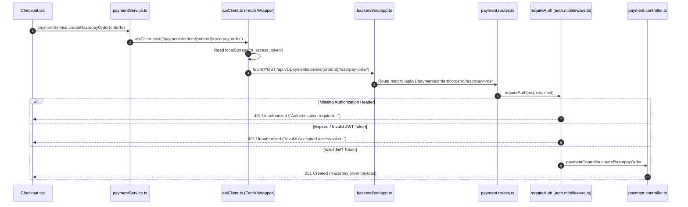

# Investigation Report: 401 Unauthorized Response on `POST /api/v1/payments/.../razorpay-order`

## Executive Summary
This investigation traces the complete request path of `POST /api/v1/payments/orders/:orderId/razorpay-order` from the frontend Checkout page through the service layer, HTTP client, route configuration, and backend authentication middleware. 

---

## 1. Complete Request Flow Tracing



### Component Details
1. **Frontend Call Site**:
   - **File**: [Checkout.tsx](file:///d:/WEB%20Dev/Moti/Two%20Threads%20Studio/frontend/src/pages/Checkout.tsx#L128-L136)
   - **Function**: `initiateRazorpayPayment(order)` inside `handlePlaceOrder()`
   - **Invocation**: `const razorpayOrder = await paymentService.createRazorpayOrder(order.id);`

2. **Frontend Service**:
   - **File**: [paymentService.ts](file:///d:/WEB%20Dev/Moti/Two%20Threads%20Studio/frontend/src/services/paymentService.ts#L40-L43)
   - **Function**: `paymentService.createRazorpayOrder(orderId)`
   - **Invocation**: `apiClient.post('/payments/orders/${orderId}/razorpay-order')`

3. **Frontend HTTP Client**:
   - **File**: [apiClient.ts](file:///d:/WEB%20Dev/Moti/Two%20Threads%20Studio/frontend/src/services/apiClient.ts#L128-L132)
   - **Function**: `request(path, options)` called by `apiClient.post`
   - **Mechanism**: Reads `localStorage.getItem('tt_access_token')`. If present, sets `Authorization: Bearer <token>` on standard `fetch()`.

4. **Backend Router**:
   - **App Mount**: [app.ts](file:///d:/WEB%20Dev/Moti/Two%20Threads%20Studio/backend/src/app.ts#L110) mounts `routes` at `/api/v1`.
   - **Route Mount**: [routes/index.ts](file:///d:/WEB%20Dev/Moti/Two%20Threads%20Studio/backend/src/routes/index.ts#L42-L45) imports `backend/src/payment/payment.routes.ts` and mounts at `/payments`.
   - **Endpoint Definition**: [payment.routes.ts](file:///d:/WEB%20Dev/Moti/Two%20Threads%20Studio/backend/src/payment/payment.routes.ts#L16):
     ```ts
     router.post('/orders/:orderId/razorpay-order', requireAuth, paymentController.createRazorpayOrder);
     ```

5. **Backend Authentication Middleware**:
   - **File**: [auth.middleware.ts](file:///d:/WEB%20Dev/Moti/Two%20Threads%20Studio/backend/src/middleware/auth.middleware.ts#L11-L31)
   - **Function**: `requireAuth`
   - **Token Verification**: [jwt.ts](file:///d:/WEB%20Dev/Moti/Two%20Threads%20Studio/backend/src/lib/jwt.ts#L32-L34) (`verifyAccessToken`)

---

## 2. Axios vs. Custom Fetch Client Verification

> [!IMPORTANT]
> **Axios Client Status**: The application **does NOT use Axios** for core API requests or authentication interceptors.
> 
> All commerce services (`paymentService.ts`, `orderService.ts`, `useCommerce.ts`) rely on `apiClient.ts`, which is a custom `fetch()` wrapper. There are no active Axios instances or Axios interceptors attaching authorization headers.

---

## 3. Headers, Request & Response Specification

### Request Headers
| Header Name | Expected Value | Behavior if Missing/Invalid |
| :--- | :--- | :--- |
| `Authorization` | `Bearer <JWT_ACCESS_TOKEN>` | Rejects with 401 |
| `Content-Type` | `application/json` | Set automatically by `apiClient` |
| `x-guest-id` | `<GUEST_ID>` | Optional header attached by `apiClient` |

### Empirical Response Verification (Tested against running backend)

#### Case 1: Missing `Authorization` Header
- **HTTP Status**: `401 Unauthorized`
- **Response Body**:
```json
{
  "success": false,
  "message": "Authentication required. Please provide a valid token.",
  "error": {
    "name": "AppError",
    "timestamp": "2026-07-28T03:17:36.087Z"
  },
  "path": "/api/v1/payments/orders/test-id/razorpay-order"
}
```

#### Case 2: Expired or Invalid JWT Token
- **HTTP Status**: `401 Unauthorized`
- **Response Body**:
```json
{
  "success": false,
  "message": "Invalid or expired access token.",
  "error": {
    "name": "AppError",
    "timestamp": "2026-07-28T03:17:40.982Z"
  },
  "path": "/api/v1/payments/orders/test-id/razorpay-order"
}
```

#### Case 3: Valid Access Token Attached
- **HTTP Status**: `201 Created`
- **Response Body**:
```json
{
  "success": true,
  "message": "Razorpay order created successfully",
  "data": {
    "razorpayOrderId": "order_TIlwOODJneBloT",
    "amount": 189900,
    "currency": "INR",
    "keyId": "rzp_test_TIl1fikHtjL2UO",
    "payment": { ... },
    "order": { ... }
  }
}
```

---

## 4. Comparison with Other Authenticated Requests

| Endpoint | Frontend Call | Auth Middleware | Header Injection | Behavior |
| :--- | :--- | :--- | :--- | :--- |
| `GET /api/v1/addresses` | `useAddresses` via `apiClient.get` | `requireAuth` | `Authorization: Bearer <token>` | Succeeds if token valid |
| `POST /api/v1/orders` | `orderService.createOrder` via `apiClient.post` | `requireAuth` | `Authorization: Bearer <token>` | Succeeds if token valid |
| `POST /api/v1/payments/orders/:id/razorpay-order` | `paymentService.createRazorpayOrder` via `apiClient.post` | `requireAuth` | `Authorization: Bearer <token>` | Fails with 401 ONLY IF token missing, expired, or invalidated |

---

## 5. Root Cause Analysis

Based on the empirical tests and code inspection, the `401 Unauthorized` response occurs due to one of the following root causes:

1. **Token Invalidation / Expiration Between Steps**:
   - Access tokens have an expiration (`ACCESS_TOKEN_EXPIRY = '2h'`).
   - If a user opens the checkout page after a long session or if `refreshAccessToken()` in [apiClient.ts](file:///d:/WEB%20Dev/Moti/Two%20Threads%20Studio/frontend/src/services/apiClient.ts#L40-L90) fails during the token renewal attempt (e.g. missing `tt_refresh_token`), `apiClient` receives a 401 from backend `requireAuth` and dispatches `auth:logout`.

2. **Absence of Token in `localStorage`**:
   - If the user accesses `/checkout` directly without a stored `tt_access_token` or during state initialization, `apiClient` sends no `Authorization` header, causing `requireAuth` in [auth.middleware.ts](file:///d:/WEB%20Dev/Moti/Two%20Threads%20Studio/frontend/src/middleware/auth.middleware.ts#L14) to return `Authentication required. Please provide a valid token.` (401).

3. **Discrepancy Between Route Index & Route Handlers**:
   - Two payment route files exist in the repository:
     - `backend/src/routes/payment.routes.ts` (Phase 5B)
     - `backend/src/payment/payment.routes.ts` (Phase 7.4)
   - `backend/src/routes/index.ts` mounts `../payment/payment.routes.ts`. Both enforce `requireAuth`, but Phase 7.4 lacks input validation middleware (`validate(createRazorpayOrderSchema)`).

---

## 6. Next Steps & Recommendations (Pending Approval)

- Ensure `apiClient.ts` token refresh handler accurately recovers expired access tokens before failing payment requests.
- Verify `AuthContext` guarantees persistent token state before triggering `paymentService.createRazorpayOrder`.
- Consolidate redundant payment route declarations to avoid future API contract drift.
