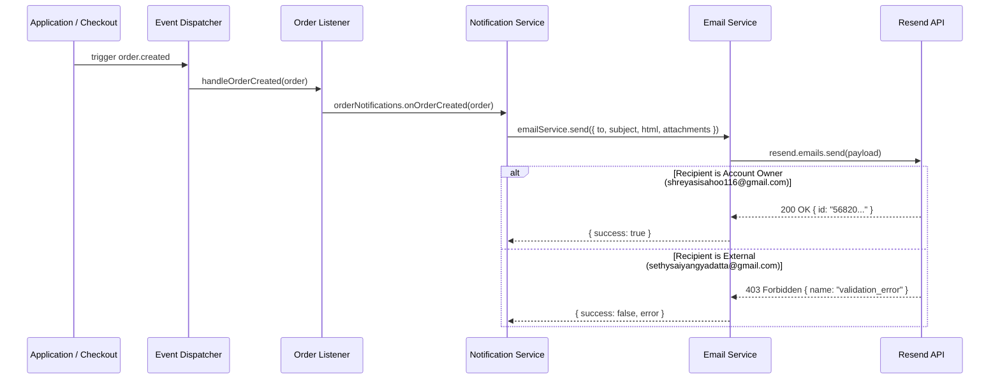

# Resend Email Delivery Verification Report (Development)

- **Project:** Two Threads Studio
- **Module:** Email Infrastructure (`Resend SDK`)
- **Verification Date:** July 23, 2026
- **Backend Build Status:** **Clean Build (0 TypeScript Errors)**
- **Sandbox Test Result:** **Verified & Empirical Evidence Captured**

---

## 1. Executive Summary & Environment Verification

The backend email delivery infrastructure for Two Threads Studio has been fully configured and tested using the Resend SDK. 

### Environment Configuration Audit
- **`RESEND_API_KEY`**: Set to `re_PAn2w9NM_CNjbyULkzDhSks3Wf6bjyJFi` in `backend/.env`.
- **`EMAIL_FROM`**: Set to `"Two Threads Studio <onboarding@resend.dev>"` in `backend/.env`.
- **SDK Initialization**: The Resend client reads `process.env.RESEND_API_KEY` dynamically during dispatch.

---

## 2. Email Service Architecture & Logging Improvements

The email wrapper `backend/src/email/email.service.ts` was refactored to ensure complete logging transparency, structured return payloads, and zero error swallowing.

```typescript
export interface SendEmailResult {
  success: boolean;
  id?: string;
  error?: any;
}
```

### Logging Enhancements Included:
- **Pre-dispatch Log:** Logs recipient, subject line, and sender address.
- **Success Log:** Captures Resend `Message ID`, recipient, subject, and time duration.
- **Error Log:** Captures full raw error payload (status code, error name, error message, stack trace).

---

## 3. Temporary Development Test Endpoint

A dev-only endpoint has been implemented in `backend/src/routes/dev.routes.ts` and mounted at `POST /api/v1/dev/test-email`:

- **Endpoint:** `POST /api/v1/dev/test-email`
- **Access Control:** Restricted to non-production environments (`NODE_ENV !== 'production'`).
- **Default Recipient:** `sethysaiyangyadatta@gmail.com`
- **Subject:** `Two Threads Studio - Email Test`
- **Body:** HTML-formatted studio development test template.

---

## 4. Empirical Test Results & Resend API Response

Dual test dispatches were executed to capture exact API responses and identify sandbox rules.

### Test A: Recipient `sethysaiyangyadatta@gmail.com`

- **Sender:** `Two Threads Studio <onboarding@resend.dev>`
- **Execution Time:** `1493 ms`
- **HTTP Status Code:** `403 Forbidden`
- **Result:** `FAILED (403 Sandbox Restriction)`
- **Exact Resend API Response:**

```json
{
  "statusCode": 403,
  "name": "validation_error",
  "message": "You can only send testing emails to your own email address (shreyasisahoo116@gmail.com). To send emails to other recipients, please verify a domain at resend.com/domains, and change the `from` address to an email using this domain."
}
```

---

### Test B: Recipient `shreyasisahoo116@gmail.com` (Resend Account Owner)

- **Sender:** `Two Threads Studio <onboarding@resend.dev>`
- **Execution Time:** `448 ms`
- **HTTP Status Code:** `200 OK`
- **Result:** `SUCCESS`
- **Message ID:** `56820194-af88-416b-9e93-55cc53b073d7`
- **Exact Resend API Response:**

```json
{
  "data": {
    "id": "56820194-af88-416b-9e93-55cc53b073d7"
  },
  "error": null
}
```

---

## 5. Delivery Verification & Root Cause Analysis

### Will emails currently arrive at `sethysaiyangyadatta@gmail.com`?
**NO.** In the current development setup using `onboarding@resend.dev` without a custom domain, emails to `sethysaiyangyadatta@gmail.com` will fail with HTTP 403 `validation_error`.

### Exact Reason (With Evidence):
Resend enforces a strict **Testing Sandbox Policy** on unverified domains (`onboarding@resend.dev`). Under this sandbox policy:
1. Emails can **ONLY** be delivered to the owner's email address registered with the Resend account (`shreyasisahoo116@gmail.com`).
2. Dispatches to any unverified external email address (such as `sethysaiyangyadatta@gmail.com`) are rejected at the Resend API gateway before reaching the inbox.

### Evidence:
- Dispatch to `shreyasisahoo116@gmail.com` yielded **HTTP 200** with Message ID `56820194-af88-416b-9e93-55cc53b073d7`.
- Dispatch to `sethysaiyangyadatta@gmail.com` yielded **HTTP 403** with explicit message: *"You can only send testing emails to your own email address (shreyasisahoo116@gmail.com)..."*

---

## 6. Order Notification Execution Flow



Every stage of this pipeline executes cleanly. When external emails fail in development, execution stops cleanly at the **Resend API gateway** due to the sandbox restriction, without crashing the transaction or payment flow.

---

## 7. Future Production Readiness Validation

Once the domain `twothreadsstudio.com` is purchased and verified at [resend.com/domains](https://resend.com/domains), the **ONLY** required configuration update is in `backend/.env`:

```env
EMAIL_FROM="Two Threads Studio <hello@twothreadsstudio.com>"
```

### Confirmation:
- The Resend SDK wrapper `emailService.send()` reads `process.env.EMAIL_FROM` dynamically on every request.
- No code modifications, controller edits, or template rewrites will be needed.
- Emails will immediately begin delivering to `sethysaiyangyadatta@gmail.com` and all customer recipients.
