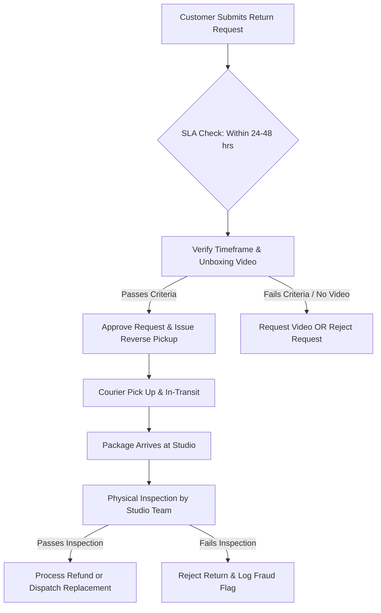

# TwoThreads Studio — Return & Replacement Operations SOP
**Document Version:** 1.0  
**Effective Date:** July 2026  
**Audience:** Studio Fulfillment Team, Customer Experience Team, Admin & Inspection Staff  
**Parent Entity:** SYS Pvt. Ltd.

---

## 1. Core Operating Philosophy

At **TwoThreads Studio**, every item is handcrafted, embroidered, and packaged individually with time and attention. Unlike mass D2C retailers, we do not absorb arbitrary return fraud or "try-and-return" abuse. 

Our policy is **"Fair but Firm"**:
* **Fair**: We immediately replace or refund items for genuine shipping damage, wrong items sent, or manufacturing defects.
* **Firm**: We strictly enforce evidence requirements (unboxing videos), clear windows, physical inspections, and non-returnable status for custom/used items to protect our craft, budget, and team.

---

## 2. Policy Eligibility Matrix (Internal Reference)

| Category / Situation | Customer Timeframe | Required Evidence | Allowed Resolution | Refund Type |
| :--- | :--- | :--- | :--- | :--- |
| **Damaged in Transit** | **48 Hours** of delivery | Continuous Unboxing Video + Photos | Free Replacement OR Full Refund | Original Payment / Credit |
| **Wrong Product Sent** | **48 Hours** of delivery | Continuous Unboxing Video + Photos | Free Item Replacement | N/A (Exchange) |
| **Missing Item / Component** | **48 Hours** of delivery | Continuous Unboxing Video | Missing Part Replacement | N/A (Dispatch) |
| **Manufacturing Defect** | **7 Days** of delivery | Photos + Detailed Description | Replacement OR Full Refund | Original Payment / Credit |
| **Custom / Engraved / Personalized** | Non-returnable | N/A | Defect/Damage Replacement ONLY | None |
| **Digital Downloads / Courses** | Non-returnable | N/A | None (Final Sale) | None |
| **Customer Change of Mind** | Non-returnable | N/A | Reject Request | None |
| **Used / Washed / Stained** | Non-returnable | N/A | Reject Request & Return to Sender | None |

---

## 3. Step-by-Step Return Lifecycle SOP

---

### Step 1: Receiving & Initial Audit (SLA: 24–48 Hours)

1. Log into the **Admin Dashboard** (`/admin/returns`).
2. Open the pending `ReturnRequest`. Verify:
   * **Delivery Timestamp**: Was the claim submitted within 48 hours for damage/wrong item, or 7 days for defect?
   * **Item Type**: Is the item personalized or digital? If yes, immediately reject unless damage/defect evidence is attached.

---

### Step 2: Unboxing Video Audit (Critical Protection)

For claims involving **Damaged Items**, **Wrong Item Received**, or **Missing Parts**, a continuous **Unboxing Video** is mandatory.

#### ✅ 4 Mandatory Video Verification Criteria:
1. **Unbroken & Continuous**: Video must be a single, unedited file without cuts, pauses, or splices.
2. **Sealed Box View**: Video must clearly show the outer package and courier shipping label **before** opening begins.
3. **Tracking Label Legibility**: Shipping label details (Order #, Tracking #) must be readable on camera.
4. **Complete Extraction**: Video must show the package opening, item removal, and the exact damage or missing part in one sequence.

> [!WARNING]  
> **If the video is missing or edited:**  
> Reply using Template **ST-02 (Unboxing Video Request)**. Do NOT approve pickup without verified video evidence for transit damage or missing item claims.

---

### Step 3: Approval & Reverse Courier Dispatch

1. Upon successful audit:
   * Set Return Status to `APPROVED`.
   * Click **Schedule Reverse Pickup** in the Admin Portal.
2. System auto-emits an email/SMS notification to the customer with pickup instructions.
3. Instruct customer to pack the item securely in its original box with all thread cards, needles, and linen intact.

---

### Step 4: Physical Studio Inspection (Warehouse Arrival)

When the returned package arrives at the studio:

1. Update status to `RECEIVED` → `INSPECTION_PENDING`.
2. Inspect the item against these **Physical Checks**:
   * **Stitch & Thread Test**: Has the canvas or linen been worked on? Are threads missing or unspooled?
   * **Hygiene & Wash Test**: Are there stains, perfume scents, pet hair, or signs of washing?
   * **Component Completeness**: Are all hoops, needles, instructions, and floss cards present?

3. Assign **Disposition**:
   * `RESTOCK`: Mint condition; return to inventory.
   * `REPAIR`: Minor defect fixable in studio.
   * `DAMAGED`: Transit damage or customer damage; do not restock.
   * `DISPOSE`: Unusable material.

> [!CAUTION]  
> If an item fails inspection (e.g., used/washed/damaged by customer), set status to `INSPECTION_FAILED`, document photos, and select **Reject Return**. The item will be sent back to the customer at their shipping expense.

---

### Step 5: Refund or Replacement Processing

1. **For Approved Refund**:
   * Click **Issue Refund**. Choose original payment method or Store Credit.
   * Refund is credited via Razorpay within 3–5 business days.
2. **For Approved Replacement**:
   * Click **Dispatch Replacement**.
   * A new zero-value fulfillment order is generated automatically.

---

## 4. Personalized & Made-to-Order Handling

Items with:
* Custom engraved wooden hoops
* Custom name or date embroidery
* Bespoke dimensions or colorways

**Strict Rule:**  
**No returns or cancellations allowed once production has started.**

* *Exception:* Manufacturing structural defect or verified shipping damage. In such cases, only **Replacements** are offered—no refunds for customized items unless replacement is impossible.

---

## 5. Fraud Prevention & Customer Risk Management

Our system maintains a real-time `CustomerRisk` engine. Every employee must monitor flags to prevent D2C return fraud:

### High-Risk Indicators to Monitor:
1. **Empty Box / Different Item Fraud**: Customer claims box was empty or sends back an old/unrelated item.
2. **Repeat Returners**: Customer has >2 rejected returns or >3 total returns within 60 days.
3. **Damaged by Customer**: Snagged threads, scissor cuts, or spilled liquids falsely claimed as "transit damage".

### Actions for Suspicious Accounts:
* **Flag Account**: Click **Flag Customer Risk** in Admin panel.
* **COD Restrictions**: Set customer profile to `PREPAID_ONLY` to block future Cash-on-Delivery orders.
* **Packing Video Recording**: For high-value orders (>₹3,500) sent to high-risk accounts, record a continuous packing video showing item placement, sealed box, and label application.

---

## 6. Official Customer Response Templates

### Template ST-01: Return Approved & Pickup Scheduled
> Dear **[Customer Name]**,  
>  
> Thank you for contacting TwoThreads Studio. Your return request for Order **#[Order Number]** has been reviewed and approved.  
>  
> We have scheduled a reverse courier pickup for your package within 24–48 business hours. Please ensure the item is unused, in its original packaging with all thread cards and accessories intact.  
>  
> Once the package arrives at our studio and passes physical inspection, your **[refund / replacement]** will be processed promptly.  
>  
> Warm regards,  
> **TwoThreads Studio Care Team**

---

### Template ST-02: Unboxing Video Required
> Dear **[Customer Name]**,  
>  
> Thank you for reaching out regarding your recent order **#[Order Number]**.  
>  
> As noted in our Studio Policy, because all our pieces are handcrafted and packed individually, all claims for damaged items or missing components require a continuous, unedited unboxing video showing the sealed parcel and shipping label before opening.  
>  
> Please share a link to your video (via Google Drive, Loom, or email attachment) so our team can immediately verify your claim and schedule your free replacement.  
>  
> Warm regards,  
> **TwoThreads Studio Care Team**

---

### Template ST-03: Return Rejected (Used / Failed Inspection)
> Dear **[Customer Name]**,  
>  
> We have received and inspected the returned package for Order **#[Order Number]**.  
>  
> Upon physical studio inspection, our quality team noted that the product **[shows signs of use / missing materials / has been washed / fails condition requirements]**. As a handcrafted studio, we cannot accept returns for items that have been used or altered.  
>  
> Regrettably, we are unable to process a refund for this item. We can return the package to your shipping address. Please let us know how you would like to proceed.  
>  
> Warm regards,  
> **TwoThreads Studio Inspection Team**

---

## Summary Checklist for Employees

- [ ] Claim submitted within **48 hours** (damage/missing) or **7 days** (defect).
- [ ] Continuous **Unboxing Video** verified for transit damage / missing item claims.
- [ ] Custom / Personalized items verified as **non-returnable** (unless damaged).
- [ ] Reverse pickup scheduled via Admin panel.
- [ ] Physical studio inspection performed before issuing any refund.
- [ ] High-risk customer flags logged in `CustomerRisk` engine.
