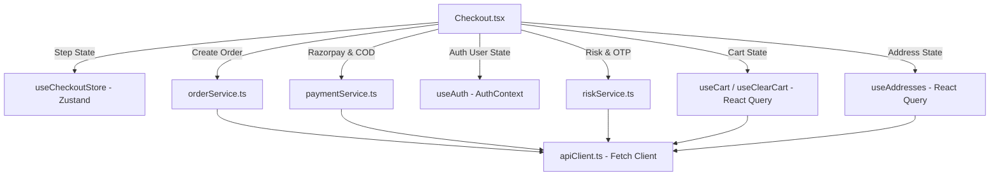

# Checkout Flow & Render Architecture

This document provides a comprehensive structural, visual, functional, and architectural analysis of the Checkout Flow in **Two Threads Studio**. It details all steps, state stores, UI components, background overlays, routing guards, and backend integration services to establish a foundation for UI redesign.

---

## Checkout Flow Sequence

The Checkout experience executes in a multi-step split-layout sequence, transitioning through the following steps and routes:

1. **Auth Guard & Cart Validation** (`/checkout`) — Redirects unauthenticated users to `/auth/login?redirect=/checkout` and empty-cart users to `/shop`.
2. **Step 1: Information & Address Selection** (`currentStep: 'cart'`) — Account confirmation & delivery address selection / creation.
3. **Step 2: Shipping Method Selection** (`currentStep: 'shipping'`) — Contact review, address summary, and shipping option selection.
4. **Step 3: Payment Method & Risk Engine** (`currentStep: 'payment'`) — Pay Online (Razorpay) vs Cash on Delivery (COD) eligibility check, prepaid discount display, and OTP verification modal.
5. **Step 4: Inline Confirmation View** (`currentStep: 'confirmation'`) — Fullscreen artisan order confirmation banner rendered directly inside `Checkout.tsx`.
6. **Dedicated Redirect Pages**:
   - `CheckoutSuccess` (`/checkout/success?order=...`) — Post-popup success fallback with 10s auto-redirect to Account dashboard.
   - `CheckoutFailed` (`/checkout/failed?order=...`) — Post-popup failure landing with retry CTA.

---

# Checkout Components & Step Breakdown

## 1. Checkout Page Shell & Split Layout

### Component
`Checkout`

### File
[Checkout.tsx](file:///d:/WEB%20Dev/Moti/Two%20Threads%20Studio/frontend/src/pages/Checkout.tsx)

### Purpose
Acts as the orchestrator for the entire multi-step checkout journey, wrapping step forms, shipping calculation, cart summary, risk checks, payment gateways, processing overlays, and security modals.

### Content & Key Elements
- **Header**: Brand logo (`TwoThreads Studio`) linking back to Home, and breadcrumbs (`Information / Shipping / Payment`).
- **Left Column**: Step-by-step form panels (Step 1 Information, Step 2 Shipping, Step 3 Payment).
- **Right Column**: Sticky Order Summary sidebar displaying cart items, thumbnails, quantities, variants, hoop finishes, custom engravings, subtotal, discount, tax (GST), shipping cost, and grand total.
- **Overlays**:
  - Processing overlay (blur background with loading spinner and dynamic progress message).
  - Risk & Trust OTP verification modal (6-digit code verification for high-value / COD orders).

### Layout
- **Desktop**: 2-column split layout (`min-h-screen bg-[#FBFBFA] flex flex-col md:flex-row`). Left column occupies 60% (`w-3/5 lg:w-2/3`) with white background; right summary column occupies 40% (`w-2/5 lg:w-1/3`) with off-white background (`#FAF9F7`) and left border.
- **Mobile**: Stacked layout. Left column form renders first, followed by the Order Summary at the bottom.

### Styling
- **Background**: Soft off-white (`#FBFBFA`) on the left, warm beige-tinted off-white (`#FAF9F7`) on the right.
- **Typography**: Serif titles (`Playfair` or `Cinzel`), tracking-wide uppercase sans-serif breadcrumbs and labels, monospace currency (`₹`) and PIN codes.
- **Colors**: Accent terracotta (`#A34A38`), primary charcoal (`#1C1C1B`), muted gray text (`#6B6B6B`), border color (`#E8E4DF`).

---

## 2. Step 1: Information & Delivery Address

### Component / Sub-Component
`Step 1 Information` & [AddressSelector](file:///d:/WEB%20Dev/Moti/Two%20Threads%20Studio/frontend/src/components/commerce/AddressSelector.tsx)

### File
[Checkout.tsx](file:///d:/WEB%20Dev/Moti/Two%20Threads%20Studio/frontend/src/pages/Checkout.tsx#L360-L406) & [AddressSelector.tsx](file:///d:/WEB%20Dev/Moti/Two%20Threads%20Studio/frontend/src/components/commerce/AddressSelector.tsx)

### Purpose
Displays logged-in user profile details and allows selecting or adding delivery addresses for fulfillment.

### Content
- **Secure Checkout Banner**: Lock icon with text explaining secure session saving.
- **Read-Only Logged-in Account Box**: Shows `user.name`, `user.email`, and `user.phone` with an "Edit Profile" link to `/account`.
- **Address Selector Grid**: Card list of saved addresses with type badges (`HOME`, `WORK`, `STUDIO`, etc.), radio selection, and "Add New Delivery Address" button/form.

### User Interaction
- Selecting an address highlights the card with a dark border and checkmark.
- Submitting without selecting an address shows an alert: *"Please select or add a shipping address."*
- "Continue to Shipping" stores shipping info in `useCheckoutStore` and transitions to Step 2.

---

## 3. Step 2: Shipping Method Selection

### Component
`Step 2 Shipping`

### File
[Checkout.tsx](file:///d:/WEB%20Dev/Moti/Two%20Threads%20Studio/frontend/src/pages/Checkout.tsx#L408-L442)

### Purpose
Allows the user to review contact details, verify the delivery destination, and select the shipping courier method.

### Content
- **Summary Box**: Displays read-only contact email and full shipping address with "Change" buttons that return to Step 1.
- **Shipping Method Box**: Standard Courier option (3-5 business days) with shipping cost (₹0 or calculated value).

### User Interaction
- Clicking "Return to Information" navigates back to Step 1.
- Clicking "Continue to Payment" transitions to Step 3 and triggers the COD eligibility check (`riskService.checkCodEligibility`).

---

## 4. Step 3: Payment Method & Risk Check

### Component
`Step 3 Payment` & Risk OTP Modal

### File
[Checkout.tsx](file:///d:/WEB%20Dev/Moti/Two%20Threads%20Studio/frontend/src/pages/Checkout.tsx#L444-L525)

### Purpose
Provides selection between online payment (Razorpay: UPI, Cards, Netbanking, Wallets) and Cash on Delivery (COD), enforces risk engine rules, applies prepaid discounts, and handles order creation.

### Content
- **Payment Method Tabs**: Dual tab bar (`Pay Online` vs `Cash on Delivery`).
  - Shows dynamic discount badge (`-X% OFF`) on `Pay Online` if prepaid discount is eligible.
  - Disables COD tab with explanation banner if risk engine marks order ineligible (`codData.codEligible === false`).
- **Method Description Panel**: Explains online redirection or exact change requirement for COD.
- **OTP Verification Modal**: Triggers when backend returns `OTP_REQUIRED` error (for first-time orders or high risk scores), requesting a 6-digit verification code sent via SMS/Email.

### Payment Execution Flow
1. User clicks **Complete Order**.
2. Creates order on backend via `orderService.createOrder()`.
3. If COD: calls `paymentService.confirmCodOrder()`, clears cart, and navigates to confirmation/success.
4. If Online: loads Razorpay script (`loadRazorpayScript()`), creates Razorpay order via `paymentService.createRazorpayOrder()`, and opens Razorpay popup (`openRazorpayPopup()`).
5. On Razorpay popup completion: verifies HMAC signature via `paymentService.verifyPayment()`, clears cart, and navigates to success page.

---

## 5. Inline Order Confirmation View

### Component
`Confirmation Step`

### File
[Checkout.tsx](file:///d:/WEB%20Dev/Moti/Two%20Threads%20Studio/frontend/src/pages/Checkout.tsx#L273-L324)

### Purpose
Full-screen celebration modal rendered inside `Checkout.tsx` when `currentStep === 'confirmation'`.

### Content
- Animated checkmark icon in terracotta (`#A34A38`).
- Header: *"Order Confirmed — Thank You for Supporting Slow Craft"*.
- Artisan message: *"Your order is received with gratitude. Our artisans are preparing your custom embroidery canvas with the highest standard of details."*
- Order details card: Order reference number (`TTS...`) and delivery estimate (3-5 business days).
- CTAs: "View Dashboard" (`/account`) and "Continue Shopping" (`/shop`).

---

## 6. Checkout Success & Failure Landing Pages

### Components
`CheckoutSuccess` & `CheckoutFailed`

### Files
- [CheckoutSuccess.tsx](file:///d:/WEB%20Dev/Moti/Two%20Threads%20Studio/frontend/src/pages/checkout/CheckoutSuccess.tsx)
- [CheckoutFailed.tsx](file:///d:/WEB%20Dev/Moti/Two%20Threads%20Studio/frontend/src/pages/checkout/CheckoutFailed.tsx)

### Purpose
Dedicated standalone routes (`/checkout/success` and `/checkout/failed`) for external redirects, fallback navigation, and payment failure handling.

### Features
- **Success Page**: Framer Motion entry animation, green checkmark icon, order reference card, confirmation email note, and 10-second automatic redirect timer to `/account`.
- **Failure Page**: Terracotta warning icon, error explanation, preserved cart notice, "Retry Payment" CTA returning to `/checkout`, and support email link (`support@twothreadsstudio.com`).

---

# State Management & Services Architecture

### Store & Hooks Specification

1. **`useCheckoutStore`** ([checkoutStore.ts](file:///d:/WEB%20Dev/Moti/Two%20Threads%20Studio/frontend/src/store/checkoutStore.ts)):
   - State: `currentStep` (`'cart' | 'shipping' | 'payment' | 'confirmation'`), `shippingInfo`, `paymentMethod`.
   - Actions: `setStep`, `setShippingInfo`, `setPaymentMethod`, `resetCheckout`.

2. **`apiClient`** ([apiClient.ts](file:///d:/WEB%20Dev/Moti/Two%20Threads%20Studio/frontend/src/services/apiClient.ts)):
   - Centralized HTTP client wrapping standard `fetch()`.
   - Automatically injects `Authorization: Bearer <tt_access_token>` and `x-guest-id`.
   - Handles concurrent 401 token refresh queueing via `/auth/refresh`.

3. **`paymentService`** ([paymentService.ts](file:///d:/WEB%20Dev/Moti/Two%20Threads%20Studio/frontend/src/services/paymentService.ts)):
   - `getPaymentConfig()`: Returns Razorpay public key ID and mode.
   - `createRazorpayOrder(orderId)`: Initiates Razorpay order on backend (`POST /payments/orders/:id/razorpay-order`).
   - `verifyPayment(orderId, payload)`: Validates HMAC signature (`POST /payments/orders/:id/verify`).
   - `confirmCodOrder(orderId)`: Confirms COD fulfillment (`POST /payments/orders/:id/cod`).
   - `loadRazorpayScript()`: Dynamically injects `https://checkout.razorpay.com/v1/checkout.js`.
   - `openRazorpayPopup()`: Opens Razorpay iframe checkout popup.

4. **`riskService`** ([riskService.ts](file:///d:/WEB%20Dev/Moti/Two%20Threads%20Studio/frontend/src/services/riskService.ts)):
   - `checkCodEligibility(cartTotal, productIds)`: Evaluates risk engine rules and prepaid discounts (`POST /risk/check-cod-eligibility`).
   - `sendOtp(identifier, reason)`: Requests SMS/Email OTP (`POST /risk/send-otp`).
   - `verifyOtp(identifier, reason, code)`: Validates 6-digit OTP code (`POST /risk/verify-otp`).

---

# Design Analysis & UI Improvement Opportunities

While functional, the current Checkout UI presents several aesthetic and UX improvement opportunities to elevate it to a world-class luxury brand standard:

### Current Limitations
1. **Form Layout**: Standard plain inputs with basic borders; lacks rich floating labels, subtle focus rings, or interactive micro-animations.
2. **Order Summary Sidebar**: Uses a basic list layout without luxury typography contrast, accordion collapsible mobile views, or progress indicators.
3. **Step Navigation**: Text breadcrumbs (`Information / Shipping / Payment`) are minimal and lack interactive step progress indicators or smooth transitions between steps.
4. **Payment Selector**: Tab buttons for Online vs COD have default borders and plain backgrounds; lacks rich payment gateway icons (UPI logos, Visa/Mastercard badges) or glassmorphic cards.
5. **Brand Aesthetics**: Does not fully harness the rich dark modes, dynamic gradients, or artisan craft imagery present on the homepage.

---

# Summary of Files to Modify for Redesign

| Layer / Component | File Location | Purpose in Redesign |
| :--- | :--- | :--- |
| **Main Page Shell** | [Checkout.tsx](file:///d:/WEB%20Dev/Moti/Two%20Threads%20Studio/frontend/src/pages/Checkout.tsx) | Complete UI restructuring, step transitions, luxury layout |
| **Address Selector** | [AddressSelector.tsx](file:///d:/WEB%20Dev/Moti/Two%20Threads%20Studio/frontend/src/components/commerce/AddressSelector.tsx) | Redesign address cards, radio buttons, and modal form |
| **Success Page** | [CheckoutSuccess.tsx](file:///d:/WEB%20Dev/Moti/Two%20Threads%20Studio/frontend/src/pages/checkout/CheckoutSuccess.tsx) | Premium receipt layout with order timeline & artisan imagery |
| **Failed Page** | [CheckoutFailed.tsx](file:///d:/WEB%20Dev/Moti/Two%20Threads%20Studio/frontend/src/pages/checkout/CheckoutFailed.tsx) | Elegant error recovery screen with clear secondary actions |
| **State Store** | [checkoutStore.ts](file:///d:/WEB%20Dev/Moti/Two%20Threads%20Studio/frontend/src/store/checkoutStore.ts) | Extend store if extra UI state (e.g. promo drawers) is needed |
